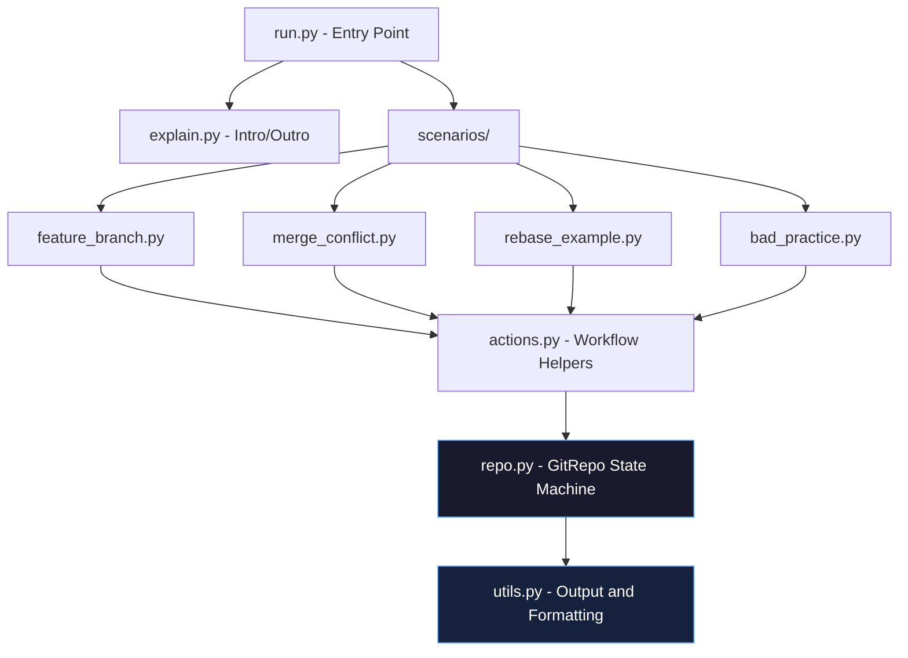
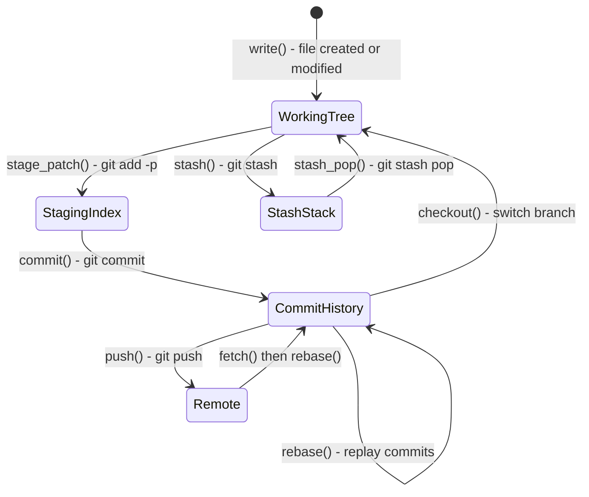
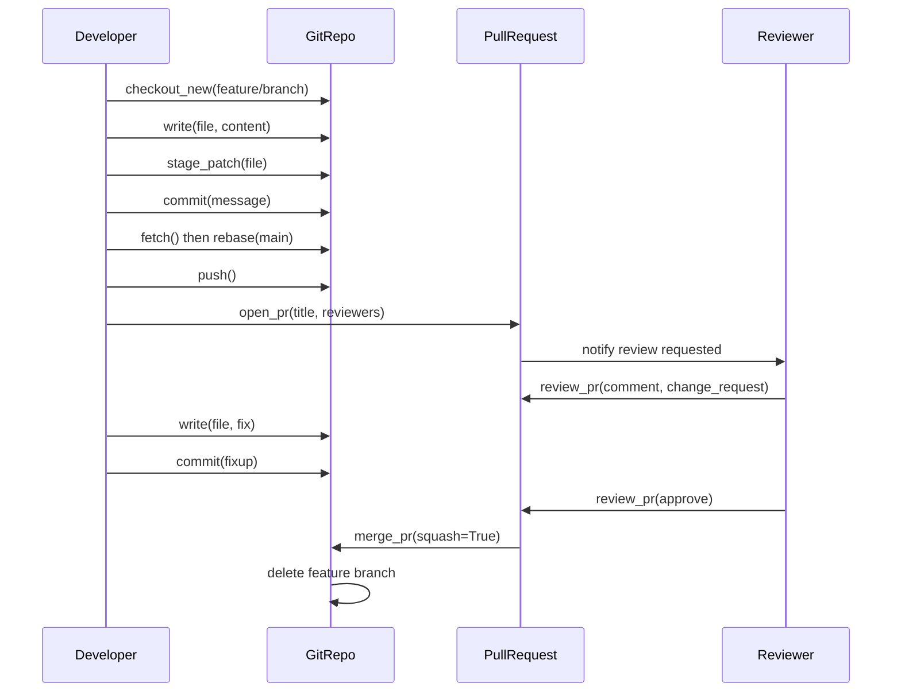
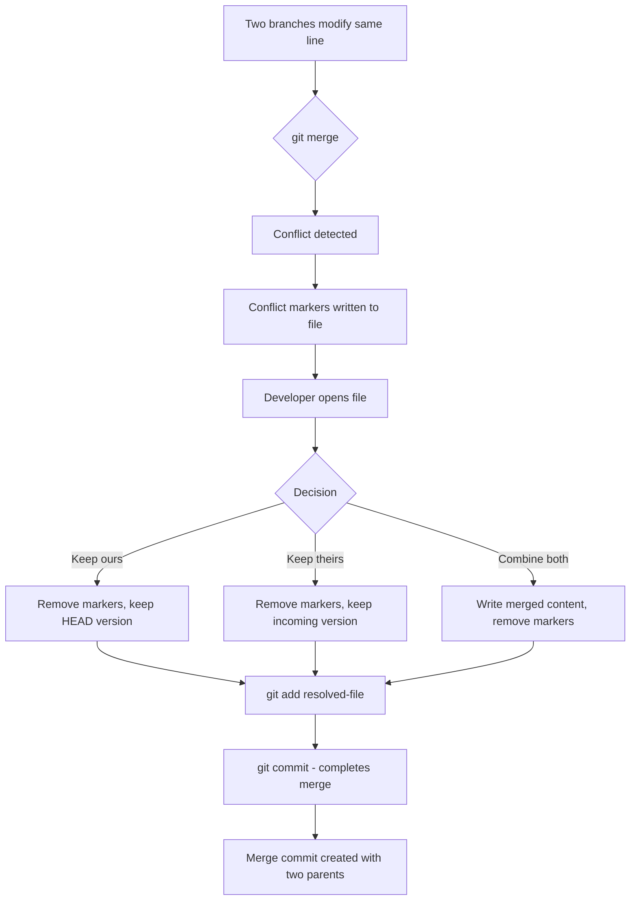

<div align="center">

# GitSim - Git Workflow Simulator

[](https://www.python.org/)
[](LICENSE)
[](https://github.com/hkevin01/gitsim)
[](https://github.com/hkevin01/gitsim)
[](https://docs.python.org/3/library/)
[](https://github.com/hkevin01/gitsim)
[](https://github.com/hkevin01/gitsim)

> A scripted, fully in-memory Git simulator for training, onboarding, and interviews.
> No real Git commands. No real repository. Accurate Git semantics with clear, colour-coded explanations at every single step.

</div>

---

## Table of Contents

- [What Is GitSim?](#what-is-gitsim)
- [Why GitSim Exists](#why-gitsim-exists)
- [Quick Start](#quick-start)
- [Scenarios](#scenarios)
- [Architecture Overview](#architecture-overview)
- [Module Reference](#module-reference)
- [Data Structures](#data-structures)
- [State Machine Flow](#state-machine-flow)
- [Algorithm and Design Decisions](#algorithm-and-design-decisions)
- [Tech Stack](#tech-stack)
- [Example Output](#example-output)
- [What the Simulator Teaches](#what-the-simulator-teaches)
- [Project Structure](#project-structure)
- [API Reference](#api-reference)
- [Key Takeaways](#key-takeaways)

---

## What Is GitSim?

GitSim is a pure-Python, fully in-memory Git workflow simulator designed to teach, demonstrate, and reinforce professional Git practices without ever touching the filesystem or executing a single real `git` command. It reproduces the complete internal state of a Git repository - branches, commits, the staging index, the working tree, remotes, and pull requests - entirely inside Python data structures. Every simulated action prints both the equivalent Git command a developer would type in a real project and a plain-English explanation of what that command does and why it matters.

The goal is not just to show the syntax. It is to build a mental model of Git's internals - understanding that a branch is just a named pointer, that a commit is an immutable content-addressed snapshot, and that rebasing is replaying commits rather than copying files. These concepts are difficult to grasp in isolation; GitSim makes them visible and sequential, so learners can watch the state change step by step.

> [!NOTE]
> GitSim uses **zero external dependencies**. It runs with any Python 3.10+ installation and requires no `pip install`, no virtual environment, and no Git binary on the host machine. This makes it ideal for sandboxed training environments, CI pipelines, and developer onboarding kiosks.

---

## Why GitSim Exists

Most Git tutorials show commands in isolation - `git branch`, `git commit`, `git merge` - without demonstrating how they interact in a real professional workflow. New developers frequently encounter problems they cannot diagnose because they lack the mental model of what Git is actually doing. They do not understand why `git rebase` rewrites history, why `git add -p` is safer than `git add .`, or why force-pushing a shared branch is destructive.

GitSim was built to close that gap. By simulating the entire lifecycle in sequence - from repository initialisation through feature branches, pull requests, code review, conflict resolution, rebasing, and intentional bad practices - it gives learners the complete picture in a single run. Each step is annotated with the rationale, not just the mechanics.

> [!IMPORTANT]
> GitSim is not a replacement for hands-on Git practice. It is a **structured introduction** that gives learners the vocabulary and mental models they need before touching a real repository. Use it before onboarding, in workshops, or as a reference for explaining Git concepts to a team.

---

## Quick Start

```bash
# Clone the repository
git clone https://github.com/hkevin01/gitsim.git
cd gitsim

# Run all 4 scenarios in sequence
python run.py

# Run a single scenario by number
python run.py --scenario 1    # Feature branch lifecycle
python run.py --scenario 2    # Merge conflict resolution
python run.py --scenario 3    # Rebasing onto main
python run.py -s 4            # Bad practices demonstration
```

> [!TIP]
> Pipe the output through `less -R` to preserve ANSI colours and scroll through it at your own pace: `python run.py | less -R`

---

## Scenarios

GitSim ships with four fully scripted scenarios. Each scenario gets its own fresh `GitRepo` instance so there is zero state bleed between runs.

| # | Scenario | What It Covers |
|---|----------|---------------|
| <sub>1</sub> | <sub>**Feature Branch Workflow**</sub> | <sub>Branch creation, staged hunks, intentional commits, fetch+rebase sync, push, PR open, change-request review, approval, squash merge, branch cleanup</sub> |
| <sub>2</sub> | <sub>**Merge Conflict Resolution**</sub> | <sub>Two diverging branches modifying the same line, conflict marker rendering, manual resolution, staging the fix, completing the merge</sub> |
| <sub>3</sub> | <sub>**Rebasing**</sub> | <sub>Standard rebase onto main to eliminate a diverged history, interactive rebase to squash WIP commits into a single clean commit, force-push after rebase</sub> |
| <sub>4</sub> | <sub>**Bad Practices**</sub> | <sub>Direct commit to main, vague commit messages, giant monolithic commits, force-push to a shared branch - all shown with explicit consequences and correct alternatives</sub> |

---

## Architecture Overview

GitSim is built around a single central class, `GitRepo`, which acts as a **pure in-memory state machine**. The state machine holds every piece of information a real Git repository would store on disk inside `.git/`: the commit object graph, branch pointer map, staging index, working tree snapshot, remote tracking references, and pull request objects.

The design is deliberately layered. Low-level repository operations live in `repo.py`. Composed multi-step workflow patterns live in `actions.py`. Narrative explanations and instructor text live in `explain.py`. Terminal formatting utilities live in `utils.py`. Scenario scripts in `scenarios/` orchestrate everything by calling the layers above in the correct sequence.



---

## Module Reference

Each module has a distinct, non-overlapping responsibility. This separation of concerns keeps each file testable and replaceable in isolation.

| # | Module | Responsibility | Key Exports |
|---|--------|---------------|-------------|
| <sub>1</sub> | <sub>`repo.py`</sub> | <sub>Core state machine - all Git semantics live here. Maintains branches, commits, index, working tree, remotes, and PRs.</sub> | <sub>`GitRepo`, `Commit`, `Branch`, `PullRequest`</sub> |
| <sub>2</sub> | <sub>`actions.py`</sub> | <sub>Composed multi-step workflow helpers. Chains repo operations into named patterns like `full_feature_cycle`.</sub> | <sub>`full_feature_cycle`, `demonstrate_stash_workflow`, `demonstrate_sync_before_commit`</sub> |
| <sub>3</sub> | <sub>`explain.py`</sub> | <sub>High-level narrative text - the instructor voice. Prints section banners and summary paragraphs between steps.</sub> | <sub>`intro`, `outro`, `section`, `scenario_intro`</sub> |
| <sub>4</sub> | <sub>`utils.py`</sub> | <sub>All terminal output primitives: ANSI colours, diff rendering, conflict block display, ASCII log graph, hash generation.</sub> | <sub>`step`, `explain`, `diff_block`, `conflict_block`, `log_graph`, `make_hash`, `banner`</sub> |
| <sub>5</sub> | <sub>`run.py`</sub> | <sub>CLI entry point. Parses `--scenario` flag, instantiates a fresh `GitRepo` per scenario, calls `intro` and `outro`.</sub> | <sub>`main`, `parse_args`</sub> |
| <sub>6</sub> | <sub>`scenarios/feature_branch.py`</sub> | <sub>Scenario 1 script - full feature lifecycle with review and squash merge.</sub> | <sub>`run(repo)`</sub> |
| <sub>7</sub> | <sub>`scenarios/merge_conflict.py`</sub> | <sub>Scenario 2 script - intentional conflict, resolution, and merge completion.</sub> | <sub>`run(repo)`</sub> |
| <sub>8</sub> | <sub>`scenarios/rebase_example.py`</sub> | <sub>Scenario 3 script - standard rebase and interactive squash rebase.</sub> | <sub>`run(repo)`</sub> |
| <sub>9</sub> | <sub>`scenarios/bad_practice.py`</sub> | <sub>Scenario 4 script - anti-patterns with explicit warnings and correct alternatives shown.</sub> | <sub>`run(repo)`</sub> |

---

## Data Structures

GitSim uses four Python dataclasses to model the core Git objects. These map closely to the actual objects Git stores in the `.git/objects` pack, making the simulator an accurate mental model of real Git internals.

### Commit Object

A `Commit` is an immutable snapshot. Once created it is never mutated. This mirrors how real Git commits are content-addressed and immutable once written to the object store.

| # | Field | Type | Description |
|---|-------|------|-------------|
| <sub>1</sub> | <sub>`hash`</sub> | <sub>`str`</sub> | <sub>40-character hex string. In real Git this is a SHA-1 (or SHA-256) hash of the content. GitSim generates random hex to simulate this.</sub> |
| <sub>2</sub> | <sub>`message`</sub> | <sub>`str`</sub> | <sub>The commit message. Should explain WHY the change was made, not what files changed.</sub> |
| <sub>3</sub> | <sub>`author`</sub> | <sub>`str`</sub> | <sub>Author name. In real Git this is name + email from `user.name` / `user.email` config.</sub> |
| <sub>4</sub> | <sub>`branch`</sub> | <sub>`str`</sub> | <sub>The branch the commit was created on. Informational only - commits belong to history, not to branches.</sub> |
| <sub>5</sub> | <sub>`files`</sub> | <sub>`dict[str, str]`</sub> | <sub>Full snapshot of all tracked files at commit time. This is the tree object in real Git terminology.</sub> |
| <sub>6</sub> | <sub>`parent`</sub> | <sub>`Optional[str]`</sub> | <sub>Hash of the parent commit. `None` only for the root commit. Merge commits would have two parents.</sub> |
| <sub>7</sub> | <sub>`ts`</sub> | <sub>`str`</sub> | <sub>ISO-8601 timestamp. GitSim uses a fake monotonic clock so logs always show a sensible chronological order.</sub> |

### Branch, PullRequest, and Repo State

| # | Structure | Fields | Purpose |
|---|-----------|--------|---------|
| <sub>1</sub> | <sub>`Branch`</sub> | <sub>`name`, `head` (hash), `upstream`</sub> | <sub>A named pointer to the tip commit of a line of development. Branches are cheap because they are just a 40-char string, not a copy of files.</sub> |
| <sub>2</sub> | <sub>`PullRequest`</sub> | <sub>`number`, `title`, `source`, `target`, `author`, `reviewers`, `approved`, `comments`, `merged`</sub> | <sub>Simulates the full PR lifecycle on platforms like GitHub and GitLab. Tracks reviewers, approval state, and comment threads.</sub> |
| <sub>3</sub> | <sub>`GitRepo._commits`</sub> | <sub>`dict[hash, Commit]`</sub> | <sub>The commit object store. Equivalent to `.git/objects`. Keyed by hash for O(1) lookup.</sub> |
| <sub>4</sub> | <sub>`GitRepo._staged`</sub> | <sub>`dict[filename, content]`</sub> | <sub>The staging index. Equivalent to `.git/index`. Files here are ready to be snapshotted in the next commit.</sub> |
| <sub>5</sub> | <sub>`GitRepo._working`</sub> | <sub>`dict[filename, content]`</sub> | <sub>The working tree. Represents files as they currently appear on disk (simulated). Dirty when different from `_tracked`.</sub> |
| <sub>6</sub> | <sub>`GitRepo._remotes`</sub> | <sub>`dict[remote, dict[branch, hash]]`</sub> | <sub>Remote tracking references. Equivalent to `.git/refs/remotes/origin/*`. Updated on fetch.</sub> |

---

## State Machine Flow

The following diagram shows how a file moves through the four zones of a Git repository. Understanding these four zones is the single most important mental model for working with Git effectively. Most Git confusion - lost changes, unexpected diffs, confusing status output - comes from not knowing which zone a change is in.



> [!NOTE]
> The staging index (also called the index or cache) is what makes Git uniquely powerful compared to simpler version control systems. It lets you craft commits that contain exactly the right set of changes - no more, no less - even when your working tree has multiple unrelated edits in progress.

---

## Pull Request Lifecycle



---

## Algorithm and Design Decisions

Understanding why specific design choices were made - and what the alternatives were - is as important as understanding what the code does.

| # | Decision | Chosen Approach | Alternatives Considered | Rationale |
|---|----------|----------------|------------------------|-----------|
| <sub>1</sub> | <sub>**Hash generation**</sub> | <sub>Random 7-char hex via `random.randbytes`</sub> | <sub>SHA-1 of content (real Git), UUID4, sequential integers</sub> | <sub>Real SHA-1 would require hashing file content and metadata, adding complexity with no training benefit. Random hex gives the correct visual appearance without the overhead. Sequential integers would not look like real Git hashes.</sub> |
| <sub>2</sub> | <sub>**Commit storage**</sub> | <sub>`dict[hash -> Commit]` - O(1) lookup by hash</sub> | <sub>List of commits, linked list, SQLite</sub> | <sub>A dict keyed by hash exactly mirrors how Git's object store works. Parent traversal is O(depth) just like real Git. A list would require O(n) hash lookup which diverges from real semantics.</sub> |
| <sub>3</sub> | <sub>**Rebase implementation**</sub> | <sub>Deep-copy commits with new hashes and updated parent pointers</sub> | <sub>Moving branch pointers only (cherry-pick simulation), patch application</sub> | <sub>Real rebase rewrites commit objects (new SHA because parent changed). Deep-copying with new hashes correctly teaches that rebase changes history, which is why force-push is required afterward. A pointer-move approach would hide this crucial lesson.</sub> |
| <sub>4</sub> | <sub>**Fluent interface**</sub> | <sub>All `GitRepo` methods return `self`</sub> | <sub>Void methods, builder pattern, command objects</sub> | <sub>Method chaining keeps scenario scripts readable and sequential, mirroring how a developer would type commands one after another in a terminal session. It also makes the call order obvious at a glance.</sub> |
| <sub>5</sub> | <sub>**File snapshots in commits**</sub> | <sub>Full content copy per commit (`deepcopy`)</sub> | <sub>Delta compression, content-addressed blob dedup</sub> | <sub>Real Git deduplicates identical content using SHA-1 addressed blob objects. GitSim uses full copies for simplicity. At training-data scale (a few KB per scenario) memory cost is negligible, and the implementation is far easier to reason about.</sub> |
| <sub>6</sub> | <sub>**Diff rendering**</sub> | <sub>Simple before/after line comparison</sub> | <sub>`difflib.unified_diff`, Myers diff algorithm</sub> | <sub>`difflib` would produce correct diffs but adds complexity. For training purposes, a simple line-by-line red/green render communicates the concept of a diff clearly enough. The goal is understanding, not byte-accurate patch generation.</sub> |
| <sub>7</sub> | <sub>**Fake clock**</sub> | <sub>Monotonic hour counter per repo instance</sub> | <sub>`datetime.now()`, Unix timestamps, sequence numbers</sub> | <sub>Using real wall clock time would produce identical timestamps for rapid test runs, making the log graph confusing. A monotonic counter guarantees commits always appear in the correct chronological order regardless of execution speed.</sub> |
| <sub>8</sub> | <sub>**No external dependencies**</sub> | <sub>Python stdlib only</sub> | <sub>`GitPython`, `pygit2`, `click`, `rich`</sub> | <sub>Zero-dependency design means GitSim runs in any Python environment without setup. This is critical for onboarding environments, air-gapped systems, and CI containers where `pip install` may not be available or trusted.</sub> |

---

## Tech Stack

GitSim is intentionally minimal. Every technology choice was made to maximise portability and minimise the barrier to running it.

| # | Component | Technology | Version | Why This Choice |
|---|-----------|-----------|---------|----------------|
| <sub>1</sub> | <sub>Language</sub> | <sub>Python</sub> | <sub>3.10+</sub> | <sub>Ubiquitous in developer environments. Dataclasses (3.7+) and `from __future__ import annotations` (3.10+ style) keep the code clean and type-safe without a build step.</sub> |
| <sub>2</sub> | <sub>Data modelling</sub> | <sub>`dataclasses`</sub> | <sub>stdlib</sub> | <sub>Provides typed, auto-`__repr__` structs for `Commit`, `Branch`, and `PullRequest` without the overhead of Pydantic or attrs.</sub> |
| <sub>3</sub> | <sub>Deep copy</sub> | <sub>`copy.deepcopy`</sub> | <sub>stdlib</sub> | <sub>Required for rebase (rewriting commit objects) and for snapshotting working tree state into commits without shared references.</sub> |
| <sub>4</sub> | <sub>CLI parsing</sub> | <sub>`argparse`</sub> | <sub>stdlib</sub> | <sub>Standard, zero-dependency CLI argument parsing. `click` or `typer` would be more ergonomic but add an external dependency for minimal gain.</sub> |
| <sub>5</sub> | <sub>Terminal output</sub> | <sub>ANSI escape codes</sub> | <sub>-</sub> | <sub>Works on all POSIX terminals and modern Windows Terminal without any library. `rich` would be prettier but again adds a dependency.</sub> |
| <sub>6</sub> | <sub>Random number generation</sub> | <sub>`random`</sub> | <sub>stdlib</sub> | <sub>Used only for fake commit hash generation. `secrets` or `os.urandom` would be cryptographically secure but overkill for display-only hex strings.</sub> |
| <sub>7</sub> | <sub>Date/time</sub> | <sub>`datetime`</sub> | <sub>stdlib</sub> | <sub>Used for generating plausible ISO-8601 commit timestamps via a fake monotonic clock tied to the repo's internal hour counter.</sub> |

---

## State Machine Flow (Detailed)

The diagram below shows how `GitRepo` transitions through its internal states during a full feature branch scenario. Each node represents a distinct state of the repository, and each edge represents a method call.


> [!TIP]
> This flow is the gold-standard professional Git workflow. Every step has a reason. Skipping the `fetch + rebase` step before push is one of the most common causes of rejected pushes and diverged histories in real projects.

---

## Conflict Resolution Flow



> [!WARNING]
> Never commit conflict markers (`<<<<<<<`, `=======`, `>>>>>>>`) into the repository. Always verify the file looks correct before staging the resolution. Git will allow you to commit a file that still contains conflict markers - it has no way of knowing whether those markers are intentional content or an accidental leftover.

---

## Example Output

```
==================================================================
  GitSim - Git Workflow Simulator
==================================================================

[INIT] Initialised repository 'GalacticWeather' on branch main
    git init creates a hidden .git directory that stores all version
    history, configuration, and metadata.

[BRANCH] git branch feature/add-storm-endpoint -> created at a3f9c2b
    Creating a branch is instant and cheap - it's just a named
    pointer to commit a3f9c2b. No files are copied.

[STAGE] git add -p src/weather.py -> staged selected hunks
    git add -p (patch mode) lets you review each change hunk
    individually and choose whether to stage it.

[COMMIT] "feat(api): add storm endpoint with severity scoring"  [b7d1e4f]
    git commit saves the staged snapshot permanently into history.

[PR] Opened Pull Request #1: "feat: add storm endpoint"
[REVIEW] Hemmer APPROVED PR #1
[MERGE] Squash merge: feature/add-storm-endpoint -> main  [c8e2f5a]

[CONFLICT] Merge conflict in src/parser.py
<<<<<<< HEAD
def parse(data): raise TypeError('str required')
=======
def parse(data): if data is None: return ''
>>>>>>> incoming

[RESOLVE] Conflict in src/parser.py resolved and staged
[REBASE] git rebase origin/main -> replaying commits on top of main
[WARNING] You are committing DIRECTLY to main!
```

---

## What the Simulator Teaches

Each concept is not just named - it is demonstrated with state changes, diffs, and explicit explanations. The table below maps each concept to how GitSim makes it visible and tangible.

| # | Concept | How GitSim Shows It | Why It Matters |
|---|---------|--------------------|--------------:|
| <sub>1</sub> | <sub>**Branching strategy**</sub> | <sub>Every feature starts with `checkout_new` from an up-to-date main. The branch pointer is shown as a hash.</sub> | <sub>Prevents unreviewed code from reaching main and allows parallel work streams.</sub> |
| <sub>2</sub> | <sub>**Staging vs committing**</sub> | <sub>WRITE -> STAGE -> COMMIT shown sequentially with diffs and `git status` output at each step.</sub> | <sub>Staging is Git's superpower. It lets you craft atomic commits even when your working tree has mixed changes.</sub> |
| <sub>3</sub> | <sub>**Pull Requests**</sub> | <sub>Full PR lifecycle: open, comment thread, change-request, fix, re-review, approve, squash merge.</sub> | <sub>PRs are the primary code quality gate in every professional team. Understanding the full lifecycle is essential.</sub> |
| <sub>4</sub> | <sub>**Code review**</sub> | <sub>Reviewer requests changes; developer addresses feedback with a fixup commit; reviewer re-approves.</sub> | <sub>Code review improves quality, spreads knowledge, and catches bugs before they reach production.</sub> |
| <sub>5</sub> | <sub>**Merge conflicts**</sub> | <sub>Two branches modify the same line; conflict markers rendered; resolution staged and committed.</sub> | <sub>Conflicts are inevitable in team projects. Knowing how to read and resolve them calmly is a core skill.</sub> |
| <sub>6</sub> | <sub>**Rebasing**</sub> | <sub>Standard rebase + interactive rebase. Commit hashes change after rebase - shown explicitly.</sub> | <sub>Rebase produces a linear, readable history. Understanding that it rewrites hashes explains why force-push is needed.</sub> |
| <sub>7</sub> | <sub>**Stashing**</sub> | <sub>Mid-task stash, branch switch, hotfix, stash pop, resume original work.</sub> | <sub>Stash is a temporary shelf for incomplete work. Without it, half-finished changes would block branch switches.</sub> |
| <sub>8</sub> | <sub>**Bad practices**</sub> | <sub>Direct main commit, force push, giant commits, vague messages - shown with explicit `[WARNING]` tags and consequences.</sub> | <sub>Seeing what goes wrong - and why - is more memorable than abstract rules. Negative examples stick.</sub> |
| <sub>9</sub> | <sub>**Commit graph**</sub> | <sub>ASCII log graph printed after each scenario showing branch topology and parent relationships.</sub> | <sub>Visualising the DAG makes abstract concepts like diverged histories and rebase linearisation concrete.</sub> |

---

## Project Structure

```
gitsim/
├── run.py                         <- CLI entry point, argparse, scenario dispatch
├── README.md                      <- This file
└── gitsim/
    ├── __init__.py
    ├── repo.py                    <- GitRepo state machine (the core engine)
    ├── actions.py                 <- Composed workflow helpers (feature cycle, stash demo)
    ├── explain.py                 <- Narrator / instructor voice (intro, outro, section)
    ├── utils.py                   <- ANSI colours, diff blocks, log graph, hash gen
    └── scenarios/
        ├── __init__.py
        ├── feature_branch.py      <- Scenario 1: full feature lifecycle
        ├── merge_conflict.py      <- Scenario 2: conflict creation and resolution
        ├── rebase_example.py      <- Scenario 3: standard + interactive rebase
        └── bad_practice.py        <- Scenario 4: anti-patterns with consequences
```

---

## API Reference

<details>
<summary><strong>GitRepo - Core State Machine (click to expand)</strong></summary>

`GitRepo` is the central class. All methods return `self` for fluent chaining unless otherwise noted.

**Lifecycle Methods**

| Method | Signature | Description |
|--------|-----------|-------------|
| <sub>`__init__`</sub> | <sub>`(name: str, author: str = "Dev")`</sub> | <sub>Create an uninitialised repo. Call `init()` before anything else.</sub> |
| <sub>`init`</sub> | <sub>`() -> GitRepo`</sub> | <sub>Create root commit, create `main` branch, mark repo as initialised.</sub> |
| <sub>`add_remote`</sub> | <sub>`(name: str = "origin") -> GitRepo`</sub> | <sub>Register a simulated remote. Snapshots current branch heads as remote tracking refs.</sub> |

**Working Tree and Staging**

| Method | Signature | Description |
|--------|-----------|-------------|
| <sub>`write`</sub> | <sub>`(filename: str, content: str) -> GitRepo`</sub> | <sub>Write a file to the working tree (simulates editing a file in your editor). Prints a diff.</sub> |
| <sub>`stage_patch`</sub> | <sub>`(filename: str) -> GitRepo`</sub> | <sub>Stage a file from working tree to index. Simulates `git add -p`.</sub> |
| <sub>`commit`</sub> | <sub>`(message: str) -> GitRepo`</sub> | <sub>Snapshot staged files into a new commit. Advances current branch pointer.</sub> |
| <sub>`status`</sub> | <sub>`() -> GitRepo`</sub> | <sub>Print working tree and staging status. Simulates `git status`.</sub> |
| <sub>`stash`</sub> | <sub>`() -> GitRepo`</sub> | <sub>Save dirty working tree state to stash stack. Simulates `git stash`.</sub> |
| <sub>`stash_pop`</sub> | <sub>`() -> GitRepo`</sub> | <sub>Restore most recent stash entry. Simulates `git stash pop`.</sub> |

**Branching and History**

| Method | Signature | Description |
|--------|-----------|-------------|
| <sub>`checkout`</sub> | <sub>`(branch: str) -> GitRepo`</sub> | <sub>Switch to an existing branch. Updates working tree snapshot. Simulates `git checkout`.</sub> |
| <sub>`checkout_new`</sub> | <sub>`(branch: str) -> GitRepo`</sub> | <sub>Create and switch to a new branch from current HEAD. Simulates `git checkout -b`.</sub> |
| <sub>`merge`</sub> | <sub>`(source: str) -> GitRepo`</sub> | <sub>Merge `source` branch into current branch. Detects and displays conflicts if any.</sub> |
| <sub>`rebase`</sub> | <sub>`(onto: str) -> GitRepo`</sub> | <sub>Replay current branch commits on top of `onto`. Rewrites hashes to show history rewrite.</sub> |
| <sub>`log`</sub> | <sub>`() -> GitRepo`</sub> | <sub>Print ASCII commit graph showing branch topology and parent relationships.</sub> |

**Remote Operations**

| Method | Signature | Description |
|--------|-----------|-------------|
| <sub>`fetch`</sub> | <sub>`() -> GitRepo`</sub> | <sub>Update remote tracking refs. Does NOT modify local branches. Simulates `git fetch`.</sub> |
| <sub>`pull`</sub> | <sub>`() -> GitRepo`</sub> | <sub>Fetch + merge remote changes into current branch. Simulates `git pull`.</sub> |
| <sub>`push`</sub> | <sub>`() -> GitRepo`</sub> | <sub>Update remote tracking refs to match local branch. Simulates `git push`.</sub> |

**Pull Requests**

| Method | Signature | Description |
|--------|-----------|-------------|
| <sub>`open_pr`</sub> | <sub>`(title: str, reviewers: list[str]) -> PullRequest`</sub> | <sub>Open a simulated PR from current branch to main. Returns the `PullRequest` object.</sub> |
| <sub>`review_pr`</sub> | <sub>`(pr, reviewer, approve, comment) -> GitRepo`</sub> | <sub>Submit a review. Set `approve=True` for approval, `False` for change-request.</sub> |
| <sub>`merge_pr`</sub> | <sub>`(pr, squash=True) -> GitRepo`</sub> | <sub>Merge an approved PR. `squash=True` collapses feature commits into one on main.</sub> |

</details>

<details>
<summary><strong>actions.py - Workflow Helpers (click to expand)</strong></summary>

| Function | Signature | Description |
|----------|-----------|-------------|
| <sub>`full_feature_cycle`</sub> | <sub>`(repo, branch_name, filename, content, commit_msg, pr_title, reviewer) -> PullRequest`</sub> | <sub>Execute the complete professional feature workflow in one call: checkout, write, stage, commit, fetch, rebase, push, open PR, review, approve, squash merge.</sub> |
| <sub>`demonstrate_sync_before_commit`</sub> | <sub>`(repo) -> None`</sub> | <sub>Show the correct fetch+rebase pattern with explanation of why it prevents diverged histories.</sub> |
| <sub>`demonstrate_stash_workflow`</sub> | <sub>`(repo, filename) -> None`</sub> | <sub>Show stash save / branch switch / hotfix / stash pop sequence with status output at each step.</sub> |

</details>

<details>
<summary><strong>utils.py - Output Primitives (click to expand)</strong></summary>

| Function | Signature | Description |
|----------|-----------|-------------|
| <sub>`banner`</sub> | <sub>`(text, colour) -> None`</sub> | <sub>Print a bold 66-char wide section header box.</sub> |
| <sub>`step`</sub> | <sub>`(tag, message, colour) -> None`</sub> | <sub>Print a `[TAG] message` line. Used for every simulated Git command.</sub> |
| <sub>`explain`</sub> | <sub>`(text, indent) -> None`</sub> | <sub>Print a dimmed, word-wrapped explanation block. The "instructor voice" at the terminal level.</sub> |
| <sub>`diff_block`</sub> | <sub>`(filename, before, after) -> None`</sub> | <sub>Render a red/green unified-style diff. Before lines in red, after lines in green.</sub> |
| <sub>`conflict_block`</sub> | <sub>`(filename, ours, theirs) -> None`</sub> | <sub>Render Git conflict markers with colour-coded HEAD and incoming sections.</sub> |
| <sub>`log_graph`</sub> | <sub>`(commits, branches) -> None`</sub> | <sub>Print ASCII commit DAG with branch labels and parent relationships.</sub> |
| <sub>`make_hash`</sub> | <sub>`() -> str`</sub> | <sub>Generate a random 7-character lowercase hex string to simulate a Git short hash.</sub> |
| <sub>`fake_timestamp`</sub> | <sub>`(hour) -> str`</sub> | <sub>Return a deterministic ISO-8601 timestamp based on a monotonic hour counter.</sub> |
| <sub>`warning`</sub> | <sub>`(text) -> None`</sub> | <sub>Print a red `[WARNING]` tagged message. Used for bad-practice demonstrations.</sub> |
| <sub>`success`</sub> | <sub>`(text) -> None`</sub> | <sub>Print a green `[OK]` tagged message. Used for successful operation confirmations.</sub> |

</details>

---

## Key Takeaways

> [!IMPORTANT]
> These eight rules represent the professional Git workflow that GitSim demonstrates across all four scenarios. They are not arbitrary conventions - each one exists to solve a specific, recurring problem in team software development.

1. **Every task gets its own branch, branched from up-to-date main.** Working directly on main bypasses all quality controls and risks destabilising the shared codebase.

2. **Stage intentionally with `git add -p`.** Staging individual hunks rather than entire files ensures each commit contains exactly one logical change, making history bisectable and reviewable.

3. **Commit messages explain WHY, not what.** The diff already shows what changed. The message should explain the reason, the business context, or the problem being solved - information that cannot be inferred from the code alone.

4. **Always fetch and rebase before pushing.** This ensures your branch is built on top of the latest remote state, prevents diverged histories, and makes the eventual merge trivial.

5. **PRs require review and CI pass before merging.** No developer is immune to bugs. A second set of eyes and automated tests are the primary defences against regressions.

6. **Squash merge keeps main history clean.** A feature may take dozens of WIP commits to develop. Squashing collapses them into a single meaningful commit on main, making `git log` on the main branch a useful audit trail rather than noise.

7. **Delete branches after merging.** Stale branches create confusion about what work is active. A branch that has been merged to main has served its purpose.

8. **Never force-push to shared branches.** Force-pushing rewrites history. Anyone who has based work on the old commits will have a diverged history that is painful to reconcile. Force-push is only safe on branches that only you are using.

---

## No Dependencies

GitSim uses only the Python standard library. There is nothing to install and no version conflicts to manage. This is a deliberate architectural decision to maximise portability and minimise setup friction for training environments.

```bash
python --version   # >= 3.10 recommended
python run.py
```

> [!TIP]
> To run a specific scenario without seeing all four, use the `--scenario` flag. This is useful in workshops where you want to focus on one concept at a time: `python run.py --scenario 2` to demonstrate conflict resolution, for example.

---

<div align="center">

Built for developers, by developers. No real Git commands harmed in the making of this simulator.

</div>

---

## What It Does

GitSim builds a fake Git repository in memory, then walks through every important Git concept with coloured terminal output and plain-English explanations at every step.

| # | Scenario |
|---|---------|
| <sub>1</sub> | <sub>Feature branch lifecycle - branch, stage, commit, PR, review, squash merge</sub> |
| <sub>2</sub> | <sub>Merge conflicts - how they arise, conflict markers, resolution workflow</sub> |
| <sub>3</sub> | <sub>Rebasing - rebase onto main, interactive rebase to clean commits</sub> |
| <sub>4</sub> | <sub>Bad practices - direct commits to main, force push, vague messages</sub> |

---

## Project Structure

```
gitsim/
├── run.py                         <- entry point
├── README.md
└── gitsim/
    ├── __init__.py
    ├── repo.py                    <- GitRepo state machine (the core)
    ├── actions.py                 <- composed workflow helpers
    ├── explain.py                 <- narrator / instructor voice
    ├── utils.py                   <- ANSI colours, diff blocks, log graph
    └── scenarios/
        ├── __init__.py
        ├── feature_branch.py      <- Scenario 1
        ├── merge_conflict.py      <- Scenario 2
        ├── rebase_example.py      <- Scenario 3
        └── bad_practice.py        <- Scenario 4
```

---

## Quick Start

```bash
cd /home/kevin/Projects/gitsim

# Run all 4 scenarios
python run.py

# Run a single scenario
python run.py --scenario 1    # feature branch
python run.py --scenario 2    # merge conflict
python run.py --scenario 3    # rebasing
python run.py -s 4            # bad practices
```

---

## Example Output

```
==================================================================
  GitSim - Git Workflow Simulator
==================================================================

[INIT] Initialised repository 'GalacticWeather' on branch main
    git init creates a hidden .git directory that stores all version
    history, configuration, and metadata.

[BRANCH] git branch feature/add-storm-endpoint -> created at a3f9c2b
    Creating a branch is instant and cheap - it's just a named
    pointer to commit a3f9c2b. No files are copied.

[STAGE] git add -p src/weather.py -> staged selected hunks
    git add -p (patch mode) lets you review each change hunk
    individually and choose whether to stage it.

[COMMIT] "feat(api): add storm endpoint with severity scoring"  [b7d1e4f]
    git commit saves the staged snapshot permanently into history.

[PR] Opened Pull Request #1: "feat: add storm endpoint"
[REVIEW] Hemmer APPROVED PR #1
[MERGE] Squash merge: feature/add-storm-endpoint -> main  [c8e2f5a]

[CONFLICT] Merge conflict in src/parser.py
<<<<<<< HEAD
def parse(data): raise TypeError('str required')
=======
def parse(data): if data is None: return ''
>>>>>>> incoming

[RESOLVE] Conflict in src/parser.py resolved and staged
[REBASE] git rebase origin/main -> replaying commits on top of main
[WARNING] You are committing DIRECTLY to main!
```

---

## What the Simulator Teaches

| Concept | How It Is Shown |
|---------|----------------|
| <sub>Branching strategy</sub> | <sub>Every feature gets its own branch from up-to-date main</sub> |
| <sub>Staging vs committing</sub> | <sub>WRITE -> STAGE -> COMMIT shown with diffs and git status</sub> |
| <sub>Pull Requests</sub> | <sub>Full PR lifecycle: open, comment, change-request, approve, merge</sub> |
| <sub>Code review</sub> | <sub>Reviewer requests changes; developer addresses feedback; re-approves</sub> |
| <sub>Merge conflicts</sub> | <sub>Two branches modify same line; conflict markers shown; resolution demonstrated</sub> |
| <sub>Rebasing</sub> | <sub>Standard rebase + interactive rebase to squash messy WIP commits</sub> |
| <sub>Stashing</sub> | <sub>Mid-task stash, switch branch, do hotfix, pop stash and continue</sub> |
| <sub>Bad practices</sub> | <sub>Direct main commit, force push, giant commits, vague messages - all shown with consequences</sub> |
| <sub>Commit graph</sub> | <sub>ASCII log graph printed after each scenario</sub> |

---

## Architecture

`GitRepo` is a pure in-memory state machine with:

- `_commits: dict[hash -> Commit]` - full history
- `_branches: dict[name -> Branch]` - branch pointers
- `_staged: dict[filename -> content]` - index
- `_working: dict[filename -> content]` - working tree
- `_tracked: dict[filename -> content]` - last commit snapshot
- `_remotes: dict[name -> {branch -> hash}]` - remote state
- `_prs: list[PullRequest]` - PR objects

All methods return `self` for fluent chaining. No side effects beyond stdout.

---

## No Dependencies

GitSim uses only the Python standard library. No pip install needed.

```bash
python --version   # >= 3.10 recommended
python run.py
```
