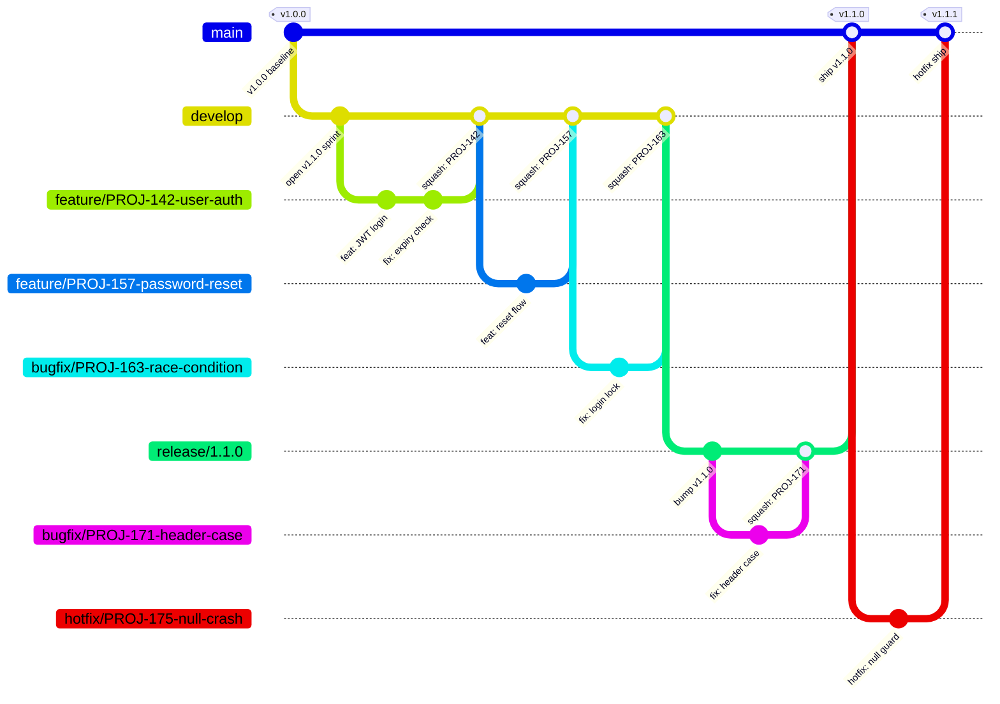
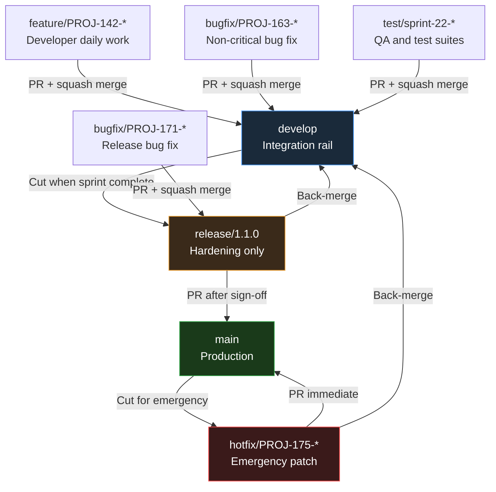
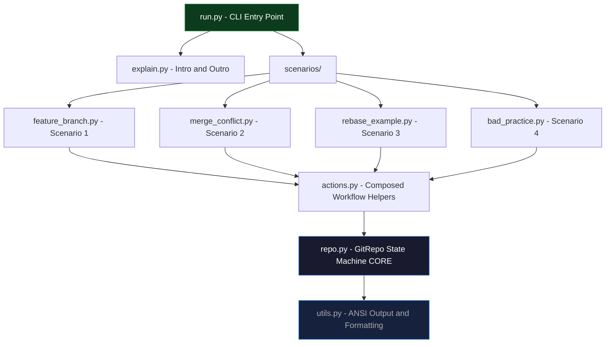
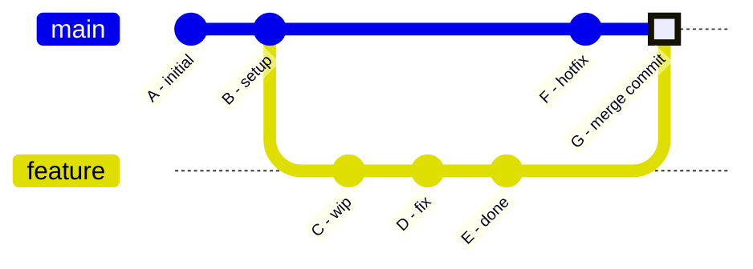
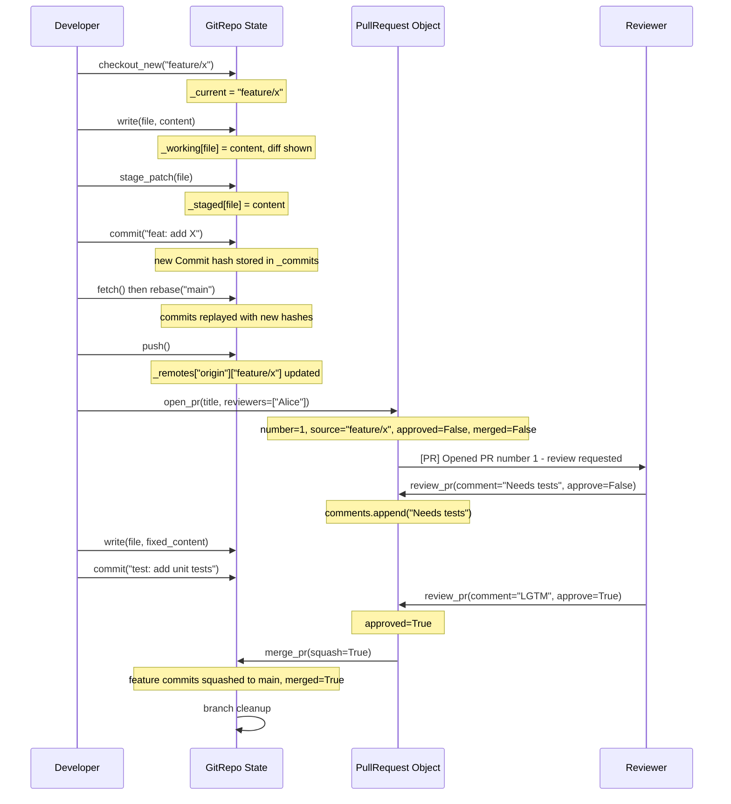
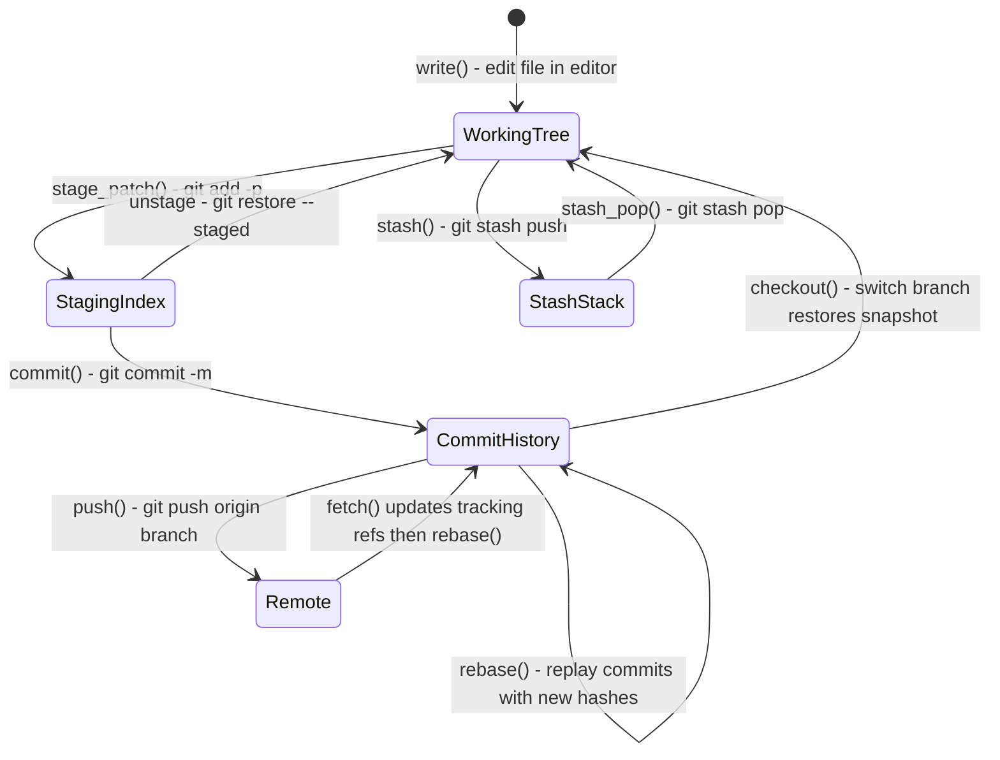
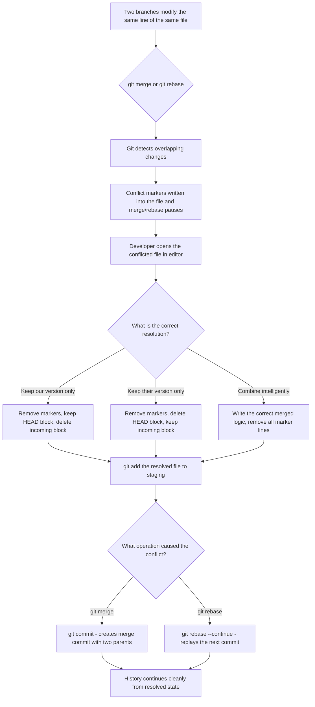

<div align="center">

# GitSim - Git Workflow Simulator

[](https://www.python.org/)
[](LICENSE)
[](https://github.com/hkevin01/gitsim)
[](https://github.com/hkevin01/gitsim)
[](https://docs.python.org/3/library/)
[](https://github.com/hkevin01/gitsim)
[](https://github.com/hkevin01/gitsim)
[](https://github.com/hkevin01/gitsim)
[](https://github.com/hkevin01/gitsim/pulls)

> A scripted, fully in-memory Git simulator for training, onboarding, and interviews.
> No real Git commands. No real repository. Accurate Git semantics with clear, colour-coded explanations at every single step.

</div>

---

## Table of Contents

- [What Is GitSim?](#what-is-gitsim)
- [Why GitSim Exists](#why-gitsim-exists)
- [Quick Start](#quick-start)
- [Scenarios](#scenarios)
- [Architecture Overview](#architecture-overview)
- [Commit vs Rebase - Deep Dive](#commit-vs-rebase---deep-dive)
- [Never Commit Directly to Main](#never-commit-directly-to-main)
- [Syncing Before You Push - Why It Matters](#syncing-before-you-push---why-it-matters)
- [Git History and Diffs - Auto vs Manual](#git-history-and-diffs---auto-vs-manual)
- [Types of Merging](#types-of-merging)
- [The PullRequest Object](#the-pullrequest-object)
- [Corporate Branching Strategy](#corporate-branching-strategy)
- [Module Reference](#module-reference)
- [Data Structures](#data-structures)
- [State Machine Flow](#state-machine-flow)
- [Algorithm and Design Decisions](#algorithm-and-design-decisions)
- [Tech Stack](#tech-stack)
- [Example Output](#example-output)
- [What the Simulator Teaches](#what-the-simulator-teaches)
- [Project Structure](#project-structure)
- [API Reference](#api-reference)
- [Key Takeaways](#key-takeaways)

---

## What Is GitSim?

GitSim is a pure-Python, fully in-memory Git workflow simulator designed to teach, demonstrate, and reinforce professional Git practices without ever touching the filesystem or executing a single real `git` command. It reproduces the complete internal state of a Git repository - branches, commits, the staging index, the working tree, remotes, and pull requests - entirely inside Python data structures. Every simulated action prints both the equivalent Git command a developer would type in a real project and a plain-English explanation of what that command does and why it matters.

The goal is not just to show the syntax. It is to build a mental model of Git's internals - understanding that a branch is just a named pointer, that a commit is an immutable content-addressed snapshot, and that rebasing is replaying commits rather than copying files. These concepts are difficult to grasp in isolation; GitSim makes them visible and sequential, so learners can watch the state change step by step in a controlled, repeatable environment.

> [!NOTE]
> GitSim uses **zero external dependencies**. It runs with any Python 3.10+ installation and requires no `pip install`, no virtual environment, and no Git binary on the host machine. This makes it ideal for sandboxed training environments, CI pipelines, and developer onboarding kiosks.

---

## Why GitSim Exists

Most Git tutorials show commands in isolation - `git branch`, `git commit`, `git merge` - without demonstrating how they interact in a real professional workflow. New developers frequently encounter problems they cannot diagnose because they lack the mental model of what Git is actually doing. They do not understand why `git rebase` rewrites history, why `git add -p` is safer than `git add .`, or why force-pushing a shared branch is destructive to teammates.

GitSim was built to close that gap. By simulating the entire lifecycle in sequence - from repository initialisation through feature branches, pull requests, code review, conflict resolution, rebasing, and intentional bad practices - it gives learners the complete picture in a single run. Each step is annotated with the rationale, not just the mechanics. The simulator is designed so that a junior developer with no Git experience can run it once and leave with enough vocabulary and mental models to participate in a professional team workflow from day one.

> [!IMPORTANT]
> GitSim is not a replacement for hands-on Git practice. It is a **structured introduction** that gives learners the vocabulary and mental models they need before touching a real repository. Use it before onboarding sessions, in lunch-and-learn workshops, or as a live demonstration tool when explaining Git concepts to a team.

---

## Quick Start

```bash
# Clone the repository
git clone https://github.com/hkevin01/gitsim.git
cd gitsim

# Run all 5 scenarios in sequence
python run.py

# Run a single scenario by number
python run.py --scenario 1    # Feature branch lifecycle
python run.py --scenario 2    # Merge conflict resolution
python run.py --scenario 3    # Rebasing onto main
python run.py -s 4            # Bad practices demonstration
python run.py -s 5            # Corporate branching strategy
```

> [!TIP]
> Pipe the output through `less -R` to preserve ANSI colours and scroll at your own pace:
> `python run.py | less -R`
> Press `q` to quit, `Space` to page down, and `/` to search for any term like `CONFLICT` or `REBASE`.

---

## Scenarios

GitSim ships with four fully scripted scenarios. Each scenario receives its own fresh `GitRepo` instance so there is zero state bleed between runs. You can run them individually or all at once.

| # | Scenario | Git Concepts Covered |
|---|----------|---------------------|
| <sub>1</sub> | <sub>**Feature Branch Workflow**</sub> | <sub>Branch creation, `git add -p` staged hunks, intentional commits, fetch+rebase sync, push to remote, PR open, change-request review cycle, final approval, squash merge, branch cleanup, commit log graph</sub> |
| <sub>2</sub> | <sub>**Merge Conflict Resolution**</sub> | <sub>Two diverging branches modifying the same line, conflict marker rendering (`<<<<<<<`, `=======`, `>>>>>>>`), manual resolution, staging the fix, completing the merge commit with two parents</sub> |
| <sub>3</sub> | <sub>**Rebasing**</sub> | <sub>Standard rebase onto main to linearise a diverged history, interactive rebase to squash multiple WIP commits into one clean commit, hash rewrite demonstration, force-push requirement after rebase</sub> |
| <sub>4</sub> | <sub>**Bad Practices**</sub> | <sub>Direct commit to main, vague commit messages, giant monolithic commits, force-push to a shared branch - all shown with explicit `[WARNING]` output and the correct alternative demonstrated immediately after each violation</sub> |
| <sub>5</sub> | <sub>**Corporate Branching Strategy**</sub> | <sub>Full enterprise branch hierarchy: `main`, `develop`, `release/x.y.z`, `feature/TICKET-description`, `bugfix/TICKET-description`, `test/sprint-description`, `hotfix/TICKET-description` - correct naming conventions, merge targets, and lifecycle rules for each tier on a large multi-developer project</sub> |

---

## Corporate Branching Strategy

On a large project with many developers working simultaneously, a flat single-branch workflow breaks down immediately. Two developers working on the same file will collide. A half-finished feature will block a critical hotfix from shipping. A poorly named branch makes it impossible to know at a glance what work is in progress. The solution is a structured branch hierarchy where every branch has a specific tier, a specific naming convention, a specific source branch it must be cut from, and a specific target it must merge back into.

GitSim Scenario 5 (`python run.py --scenario 5`) demonstrates this full hierarchy end to end, with realistic ticket-ID-based naming, multi-developer parallel work, review cycles, a release hardening phase, and an emergency hotfix. The sections below document the conventions so they can be applied directly on a real project.

> [!IMPORTANT]
> The most critical rule of corporate branching is that **the merge direction is strictly enforced**. Feature branches merge into `develop`. Release branches merge into `main` AND back into `develop`. Hotfix branches merge into `main` AND back into `develop`. Nothing except a release branch or hotfix branch ever merges directly into `main`. Violating these merge targets is the single most common cause of "lost fixes" - where a bug fix shipped in one release is accidentally missing from the next release because the fix never made it back to `develop`.

### The Branch Hierarchy



> The diagram above shows the full corporate branch lifecycle for a single sprint. Read it left to right: `main` is the bottom rail (production), `develop` is the integration rail, feature and bugfix branches fan out from `develop` and merge back in, a `release` branch is cut from `develop` for hardening, and a `hotfix` branch fans out directly from `main` for an emergency production patch.

### Branch Naming Conventions

Consistent naming is not aesthetics - it is tooling infrastructure. CI/CD pipelines use branch name prefixes to determine what environment to deploy to. JIRA and Linear use branch names to automatically link commits to tickets. Slack and Teams integrations use branch names in notifications. GitHub Actions `on: push: branches:` filters use branch name patterns. Every convention below exists because something downstream depends on it.

| # | Branch Type | Naming Pattern | Example | Source Branch | Merge Target | Lifetime |
|---|-------------|---------------|---------|--------------|-------------|----------|
| <sub>1</sub> | <sub>**main**</sub> | <sub>`main`</sub> | <sub>`main`</sub> | <sub>n/a - permanent</sub> | <sub>n/a - only receives merges</sub> | <sub>Permanent - never deleted</sub> |
| <sub>2</sub> | <sub>**develop**</sub> | <sub>`develop`</sub> | <sub>`develop`</sub> | <sub>Cut from `main` once at project start</sub> | <sub>n/a - only receives merges from feature/bugfix/test</sub> | <sub>Permanent - never deleted</sub> |
| <sub>3</sub> | <sub>**feature**</sub> | <sub>`feature/<TICKET-ID>-<kebab-description>`</sub> | <sub>`feature/PROJ-142-user-authentication`</sub> | <sub>`develop` (always up-to-date)</sub> | <sub>`develop` via PR with squash merge</sub> | <sub>Short - delete immediately after merge</sub> |
| <sub>4</sub> | <sub>**bugfix**</sub> | <sub>`bugfix/<TICKET-ID>-<kebab-description>`</sub> | <sub>`bugfix/PROJ-163-login-race-condition`</sub> | <sub>`develop` (for dev/QA bugs) or `release/x.y.z` (for release bugs)</sub> | <sub>`develop` or `release/x.y.z` depending on source</sub> | <sub>Short - delete immediately after merge</sub> |
| <sub>5</sub> | <sub>**test / qa**</sub> | <sub>`test/<sprint-or-ticket>-<description>`</sub> | <sub>`test/PROJ-sprint-22-auth-integration`</sub> | <sub>`develop`</sub> | <sub>`develop` via PR</sub> | <sub>Short - delete after merge</sub> |
| <sub>6</sub> | <sub>**release**</sub> | <sub>`release/<semver>` or `release/<year-quarter>`</sub> | <sub>`release/1.1.0` or `release/2024-Q3`</sub> | <sub>`develop` when sprint is complete</sub> | <sub>`main` AND back-merge into `develop`</sub> | <sub>Medium - kept until after release, then archived or deleted</sub> |
| <sub>7</sub> | <sub>**hotfix**</sub> | <sub>`hotfix/<TICKET-ID>-<kebab-description>`</sub> | <sub>`hotfix/PROJ-175-null-deref-crash`</sub> | <sub>`main` (ONLY branch type that does this)</sub> | <sub>`main` AND back-merge into `develop`</sub> | <sub>Short - delete immediately after both merges</sub> |
| <sub>8</sub> | <sub>**release-candidate**</sub> | <sub>`rc/<version>-rc<n>`</sub> | <sub>`rc/1.1.0-rc1`</sub> | <sub>`release/x.y.z` when ready for staging deploy</sub> | <sub>No merge target - deployed to staging, deleted after go/no-go decision</sub> | <sub>Very short - ephemeral staging snapshot</sub> |

### What Each Branch Tier Looks Like

#### Individual Developer Branch - `feature/PROJ-142-user-authentication`

This is what a developer creates for every unit of work. The ticket ID (`PROJ-142`) comes from the sprint planning system (JIRA, Linear, GitHub Issues). The description is kebab-case, lowercase, concise - enough to understand the branch purpose without reading the ticket. The developer cuts this from the latest `develop`, does all their work here, opens a PR targeting `develop`, gets at least one approval, and squash-merges. The branch is deleted the moment the PR merges.

```
git checkout develop
git pull origin develop
git checkout -b feature/PROJ-142-user-authentication
# ... work, commit, push ...
git push -u origin feature/PROJ-142-user-authentication
# open PR: feature/PROJ-142-user-authentication -> develop
```

> [!TIP]
> Many teams configure their git client to automatically name branches from ticket IDs. In JIRA, clicking "Create branch" pre-populates the name as `feature/PROJ-142-user-authentication`. In GitHub Issues, the "Create a branch" button does the same. Use these integrations - they eliminate naming inconsistencies and automatically link commits to issues.

#### Testing / QA Branch - `test/PROJ-sprint-22-auth-integration-tests`

This is what a QA engineer or developer creates when authoring or updating test suites independently of feature work. It follows the same creation, review, and merge pattern as a feature branch. Some teams use a dedicated long-lived `qa` branch that mirrors `develop` and is auto-deployed to a QA environment - individual test branches merge into `qa` rather than `develop` directly. Other teams skip the separate `qa` branch and merge test branches directly into `develop`. Either pattern works - the key is consistency.

```
git checkout develop
git pull origin develop  
git checkout -b test/PROJ-sprint-22-auth-integration-tests
# ... write tests, commit ...
git push -u origin test/PROJ-sprint-22-auth-integration-tests
# open PR: test/PROJ-sprint-22-* -> develop
```

#### Development Integration Branch - `develop`

This is the shared integration rail. It contains everything that is done but not yet shipped. It should be deployable to a development or staging environment at all times. CI runs on every push to `develop`. If `develop` is red (failing CI), fixing it is the highest priority for the entire team - a broken integration branch blocks everyone. The `develop` branch is never deleted and is never rebased - only merged into.

> [!WARNING]
> Never rebase the `develop` branch. Rebasing a shared branch rewrites the commit hashes that every developer has already pulled. Anyone with a local copy of `develop` will have a diverged history that is extremely painful to reconcile across the entire team. `develop` only ever moves forward via merge commits.

#### Release Hardening Branch - `release/1.1.0`

This is the final gate before production. When a sprint completes and `develop` is stable, a release branch is cut from `develop`. From this point, `develop` can continue accepting feature work for the next sprint while the release branch is frozen for hardening. Only bug fixes (as `bugfix/` branches merging into the release branch) are allowed on a release branch. No new features. The release branch is deployed to a staging environment for final acceptance testing, performance testing, and security review.

Once the release is signed off, the release branch merges into `main` (which triggers the production deployment) AND back-merges into `develop` (to carry forward any last-minute fixes). This double-merge is critical - skipping the back-merge into `develop` is how fixes get lost between releases.

```
git checkout develop
git pull origin develop
git checkout -b release/1.1.0
# ... only bugfixes from here ...
# When ready:
# PR: release/1.1.0 -> main   (production ship)
# PR: release/1.1.0 -> develop  (carry fixes forward)
```

#### Emergency Production Patch - `hotfix/PROJ-175-null-deref-crash`

This is the only branch type that is cut directly from `main`. It is used when a critical bug is found in production that cannot wait for the next release cycle. The developer checks out `main`, creates the hotfix branch, makes the minimal targeted fix, gets expedited review (often two approvals required even for small changes because of the production impact), and merges into `main` for immediate deployment. The hotfix is then also merged into `develop` and into any active release branch so the fix propagates everywhere.

```
git checkout main
git pull origin main
git checkout -b hotfix/PROJ-175-null-deref-crash-on-empty-token
# ... fix, test, commit ...
git push -u origin hotfix/PROJ-175-null-deref-crash-on-empty-token
# PR: hotfix/... -> main   (emergency production fix)
# PR: hotfix/... -> develop  (prevent regression in next release)
```

> [!WARNING]
> A hotfix that merges to `main` but is NOT back-merged into `develop` will be overwritten by the next regular release. This is one of the most common and damaging Git mistakes in production systems. Always create BOTH PRs - one to `main` and one to `develop` - when shipping a hotfix.

### Merge Direction Rules Summary



> The arrows show the **only permitted merge directions**. Feature, bugfix, and test branches all converge on `develop`. Release branches fan out from `develop` and merge into both `main` and back into `develop`. Hotfix branches fan out from `main` and merge into both `main` and `develop`. There are no shortcuts.

### Branch Protection Rules (What GitHub Enforces)

In a real corporate repository, the branch hierarchy is enforced by branch protection rules configured at the repository level. GitSim simulates the workflow you would follow under these rules. The table below shows typical protection settings for each long-lived branch tier.

| # | Branch | Require PR | Min Approvals | Require CI Pass | Allow Direct Push | Allow Force Push | Delete on Merge |
|---|--------|-----------|--------------|----------------|------------------|-----------------|----------------|
| <sub>1</sub> | <sub>`main`</sub> | <sub>Yes - required</sub> | <sub>2</sub> | <sub>Yes - all checks</sub> | <sub>No</sub> | <sub>No</sub> | <sub>n/a - permanent</sub> |
| <sub>2</sub> | <sub>`develop`</sub> | <sub>Yes - required</sub> | <sub>1</sub> | <sub>Yes - unit tests</sub> | <sub>No</sub> | <sub>No</sub> | <sub>n/a - permanent</sub> |
| <sub>3</sub> | <sub>`release/*`</sub> | <sub>Yes - required</sub> | <sub>2</sub> | <sub>Yes - full suite</sub> | <sub>No</sub> | <sub>No</sub> | <sub>After double-merge</sub> |
| <sub>4</sub> | <sub>`feature/*`</sub> | <sub>Recommended</sub> | <sub>1</sub> | <sub>Yes - unit tests</sub> | <sub>No (by policy)</sub> | <sub>Only author (own branch)</sub> | <sub>Yes - auto on merge</sub> |
| <sub>5</sub> | <sub>`bugfix/*`</sub> | <sub>Yes - required</sub> | <sub>1</sub> | <sub>Yes - unit tests</sub> | <sub>No (by policy)</sub> | <sub>Only author (own branch)</sub> | <sub>Yes - auto on merge</sub> |
| <sub>6</sub> | <sub>`hotfix/*`</sub> | <sub>Yes - URGENT flag</sub> | <sub>2</sub> | <sub>Yes - all checks</sub> | <sub>No</sub> | <sub>No</sub> | <sub>Yes - after both merges</sub> |

---

## Architecture Overview

GitSim is built around a single central class, `GitRepo`, which acts as a **pure in-memory state machine**. The state machine holds every piece of information a real Git repository would store on disk inside `.git/`: the commit object graph, branch pointer map, staging index, working tree snapshot, remote tracking references, and pull request objects. Nothing is ever written to disk and no subprocess is ever spawned.

The design is deliberately layered. Low-level repository operations live in `repo.py`. Composed multi-step workflow patterns live in `actions.py`. Narrative explanations and instructor text live in `explain.py`. Terminal formatting utilities live in `utils.py`. The scenario scripts in `scenarios/` orchestrate everything by calling the layers above in the correct sequence. This separation of concerns means each layer can be understood, tested, and replaced independently.



> [!NOTE]
> `repo.py` is the only module with side effects on state. All other modules either read from it (scenarios, actions) or write to stdout (utils, explain). This makes the simulator deterministic and easy to reason about - you can trace any output back to a single `GitRepo` method call.

---

## Commit vs Rebase - Deep Dive

This is one of the most misunderstood distinctions in Git. Both `git commit` and `git rebase` deal with commits and history, but they do fundamentally different things at different stages of the workflow. Confusing the two is the source of many Git disasters on real teams.

### What Is a Commit?

A commit is a permanent, immutable snapshot of your entire tracked file tree at a specific point in time. When you run `git commit`, Git takes everything in the staging index, wraps it in a commit object with your message, author, timestamp, and a pointer to the parent commit, computes a SHA hash of all that data, and stores it permanently in the object database. The commit hash is derived from the content - if any byte changes, the hash changes. This is why commits are immutable: you cannot edit a commit without producing a new object with a different hash.

In GitSim, `repo.commit(message)` does exactly this: it creates a `Commit` dataclass with a random 7-character hex hash, a reference to the current HEAD as parent, a deep copy of the staged files as the tree snapshot, and advances the current branch pointer to the new hash. The commit is stored in `_commits[hash]` for O(1) retrieval.

### What Is Rebase?

Rebase is the operation of replaying a sequence of commits onto a different base commit. When you run `git rebase main` on a feature branch, Git finds the point where your branch diverged from main, takes every commit you made since that divergence, and re-applies each one on top of the current tip of main - one at a time, in order. Each replayed commit gets a brand-new hash because its parent has changed. The old commits are not deleted immediately, but they are no longer reachable from any branch pointer, so they eventually get garbage collected.

In GitSim, `repo.rebase(onto)` deep-copies each commit in the current branch that is not in the target branch, assigns new hashes to each one, rewires the parent pointers to form a linear chain starting from the tip of the target branch, and updates the current branch pointer to the new tip. This correctly shows that rebase rewrites history - the commits look the same but they have different hashes.

> [!WARNING]
> Because rebase rewrites commit hashes, you must `git push --force-with-lease` after rebasing a branch that has already been pushed. Never rebase a branch that other people are actively working on - you will rewrite commits they have already built upon, creating a painful divergence for your teammates.

### Commit vs Rebase - Side by Side

| # | Dimension | `git commit` | `git rebase` |
|---|-----------|-------------|-------------|
| <sub>1</sub> | <sub>**What it does**</sub> | <sub>Creates a new permanent snapshot and appends it to the current branch</sub> | <sub>Replays existing commits onto a new base, creating new commit objects with new hashes</sub> |
| <sub>2</sub> | <sub>**When to use**</sub> | <sub>Any time you have staged changes you want to save as a named point in history</sub> | <sub>Before pushing, to bring your branch up to date with main without a merge commit</sub> |
| <sub>3</sub> | <sub>**Rewrites history?**</sub> | <sub>No - it only adds to history</sub> | <sub>Yes - all rebased commits get new SHA hashes</sub> |
| <sub>4</sub> | <sub>**Safe on shared branches?**</sub> | <sub>Yes - always safe</sub> | <sub>No - never rebase a branch others have checked out</sub> |
| <sub>5</sub> | <sub>**Produces a merge commit?**</sub> | <sub>No (unless it is a merge commit itself)</sub> | <sub>No - rebase produces a linear history with no merge commits</sub> |
| <sub>6</sub> | <sub>**Conflict possible?**</sub> | <sub>Only if staging conflicting changes (rare)</sub> | <sub>Yes - each replayed commit can conflict with the new base one at a time</sub> |
| <sub>7</sub> | <sub>**Affects other branches?**</sub> | <sub>No - only the current branch pointer moves</sub> | <sub>Only the current branch is rewritten; target branch is untouched</sub> |
| <sub>8</sub> | <sub>**GitSim method**</sub> | <sub>`repo.commit(message)`</sub> | <sub>`repo.rebase(onto)`</sub> |

### The Rebase vs Merge Decision

When you need to integrate changes from main into your feature branch, you have two choices: `git merge main` or `git rebase main`. Both get your branch up to date. The difference is entirely in the shape of the resulting history.

Merge creates a new merge commit with two parents, preserving the exact history of how and when branches diverged. This is honest but can make `git log --graph` hard to read on busy projects. Rebase replays your commits on top of main, producing a straight line as if you had started your branch from the latest main all along. This produces a cleaner history but rewrites your commits.

> [!TIP]
> The widely-accepted professional rule is: **rebase your own feature branches onto main before pushing or opening a PR, merge (or squash merge) when integrating a completed feature back into main**. Never rebase main onto your feature branch - always rebase your feature branch onto main.

---

## Never Commit Directly to Main

The `main` branch (sometimes called `master` in older repositories) represents the production-ready, always-deployable state of your codebase. It is the source of truth. Every commit on main should be a complete, reviewed, tested feature or fix - never a half-finished change, a debug statement, or a quick experiment.

Committing directly to main bypasses every quality control your team has in place: code review, automated tests, linting, security scans. A single bad direct commit to main can break a production deployment, corrupt shared state that your teammates have already built upon, or introduce a security vulnerability that bypasses your PR-based audit trail. In GitSim, Scenario 4 demonstrates this explicitly with `[WARNING]` output every time a direct-to-main commit is made, and then shows the correct branch-based alternative immediately after.

> [!IMPORTANT]
> Most professional teams enforce branch protection rules on `main` at the repository level (GitHub branch protection, GitLab protected branches). These rules prevent direct pushes, require pull request reviews, and require CI checks to pass before a merge is allowed. GitSim simulates the workflow you would follow under these rules even though it cannot enforce them - the bad-practice scenario shows what happens when those rules are not enforced or bypassed.

### Why Direct Commits to Main Are Dangerous

| # | Risk | What Happens | How Branches Prevent It |
|---|------|-------------|------------------------|
| <sub>1</sub> | <sub>**No review**</sub> | <sub>No second pair of eyes on the change. Bugs, security holes, and logic errors go undetected.</sub> | <sub>PR-based flow requires at least one approval before merging.</sub> |
| <sub>2</sub> | <sub>**No CI gate**</sub> | <sub>Tests are not run. Broken code reaches the shared branch immediately.</sub> | <sub>PRs trigger CI pipelines. Merge is blocked until all checks pass.</sub> |
| <sub>3</sub> | <sub>**Broken shared state**</sub> | <sub>Teammates who pull main now get broken code and cannot continue working.</sub> | <sub>Feature branches isolate work-in-progress. Main stays stable.</sub> |
| <sub>4</sub> | <sub>**No revert path**</sub> | <sub>Reverting a direct commit may be complicated by subsequent commits from teammates.</sub> | <sub>A merged PR can be reverted cleanly as a single unit.</sub> |
| <sub>5</sub> | <sub>**Audit trail loss**</sub> | <sub>No PR means no record of the discussion, the rationale, or the reviewers who approved it.</sub> | <sub>PRs create a permanent, searchable record of every change decision.</sub> |
| <sub>6</sub> | <sub>**Deployment risk**</sub> | <sub>In CD pipelines, a push to main may trigger an immediate production deployment.</sub> | <sub>PRs let you control exactly when and what reaches main.</sub> |

---

## Syncing Before You Push - Why It Matters

Before you push your feature branch to the remote and open a pull request, you must always sync your branch with the latest state of main. This means running `git fetch` followed by `git rebase origin/main` (or the equivalent in GitSim: `repo.fetch()` then `repo.rebase("main")`). Skipping this step is one of the most common sources of rejected pushes, messy merge commits, and avoidable conflicts in professional teams.

### Why Fetch First, Then Rebase?

`git fetch` downloads the latest commit objects and branch pointers from the remote without modifying any of your local branches. It updates the remote-tracking references (`origin/main`, `origin/feature/X`) so your local Git knows what the remote looks like right now. It does not touch your working tree or your local branches. `git rebase origin/main` then takes those downloaded commits and replays your feature branch commits on top of them.

This two-step sequence is important because it separates the network operation (fetch) from the local history rewrite (rebase). Running `git pull --rebase` combines both steps but offers less visibility. In GitSim, `demonstrate_sync_before_commit` in `actions.py` shows this two-step pattern explicitly with a printed explanation at each step.

> [!IMPORTANT]
> **You must sync before opening a PR, not just before pushing.** If you push your branch and then main moves forward before your PR is reviewed, your PR will show as diverged and the reviewer may ask you to rebase before merging. Building the sync habit before every push means your PRs are always based on the latest main.

### Do You Need to Sync Before Every Commit?

No. You commit frequently on your own feature branch to save progress. Syncing (fetch + rebase onto main) is done before you push your branch to the remote or before you open a PR. The workflow is:

```
branch -> commit -> commit -> commit -> SYNC -> push -> open PR
                                       ^
                                       fetch + rebase here, not before each commit
```

> [!TIP]
> If your team uses long-lived feature branches (more than a day or two), consider syncing with main once a day to reduce the size of eventual rebase conflicts. Small, frequent syncs are much easier to resolve than one large sync after two weeks of divergence.

### Sync Before Rebase or After?

The question "should I sync before I rebase?" is circular - syncing IS the rebase. The correct sequence is:

1. `git fetch` - update remote-tracking refs
2. `git rebase origin/main` - replay your commits on top of the freshly fetched main
3. Resolve any conflicts that arise during the replay
4. `git push --force-with-lease` - push the rewritten branch

There is no separate "sync" step that comes before this - fetch + rebase together constitute the sync. What you should NOT do is run `git rebase origin/main` without first running `git fetch`, because `origin/main` might be stale and you would be rebasing onto an outdated base.

---

## Git History and Diffs - Auto vs Manual?

### What Is Git History?

Git history is the directed acyclic graph (DAG) of commit objects, connected by parent pointers. Every commit points to one parent (or two, for merge commits). The history of a branch is the chain of commits reachable by following parent pointers backward from the branch tip. `git log` traverses this graph and displays it. `git log --graph` renders it as an ASCII tree.

In GitSim, `repo.log()` traverses `_commits` by following parent pointers from each branch tip and renders an ASCII graph with branch labels. The commit objects in `_commits` form the same DAG structure as real Git's object store.

### What Is a Diff?

A diff is the computed difference between two versions of a file or two commits. Git stores complete snapshots in each commit - it does not store deltas. When you ask for a diff, Git computes it on the fly by comparing the file contents of two tree objects. The diff algorithm Git uses is a variant of the **Myers diff algorithm**, which finds the shortest edit script (minimum number of insertions and deletions) that transforms one version into another.

### Auto vs Manual: The Real Question

The distinction between "automatic" and "manual" in Git contexts usually refers to conflict resolution during merges and rebases.

| # | Scenario | Auto or Manual | What Git Does | What You Must Do |
|---|----------|---------------|--------------|-----------------|
| <sub>1</sub> | <sub>**Clean merge**</sub> | <sub>Automatic</sub> | <sub>Git merges files that were changed in non-overlapping locations without any human input</sub> | <sub>Nothing - the merge completes automatically</sub> |
| <sub>2</sub> | <sub>**Conflicting merge**</sub> | <sub>Manual</sub> | <sub>Git writes conflict markers into the file and stops, waiting for human resolution</sub> | <sub>Open the file, edit it to the correct final state, run `git add`, then `git commit`</sub> |
| <sub>3</sub> | <sub>**Clean rebase**</sub> | <sub>Automatic</sub> | <sub>Each commit is replayed cleanly onto the new base with no intervention needed</sub> | <sub>Nothing - the rebase completes automatically</sub> |
| <sub>4</sub> | <sub>**Conflicting rebase**</sub> | <sub>Manual</sub> | <sub>Git stops at the conflicting commit, writes markers, and waits</sub> | <sub>Resolve the conflict, `git add`, then `git rebase --continue`</sub> |
| <sub>5</sub> | <sub>**Diff generation**</sub> | <sub>Automatic (Myers algorithm)</sub> | <sub>Git computes the shortest edit script between two trees</sub> | <sub>Nothing - diffs are always computed automatically on request</sub> |
| <sub>6</sub> | <sub>**Interactive rebase squash**</sub> | <sub>Manual (you direct it)</sub> | <sub>Git opens an editor showing commits; you mark which to squash, reword, or drop</sub> | <sub>Edit the rebase-todo list to mark commits as `squash` or `fixup`, save and exit</sub> |

GitSim demonstrates both automatic and manual resolution. In Scenario 2, `conflict_block()` renders the markers visually, and then `repo.resolve_conflict()` shows the manual resolution step. In Scenario 3, the rebase happens cleanly (automatic) and then an interactive squash is demonstrated (manual direction).

> [!NOTE]
> GitSim's `diff_block()` in `utils.py` uses a simplified before/after line comparison rather than the full Myers algorithm. The Myers algorithm minimises the edit distance by finding the longest common subsequence between two sequences of lines. For training purposes, the simplified render communicates the concept of a diff perfectly well - the exact edit-distance minimisation is a detail that does not affect learning outcomes.

---

## Types of Merging

Git offers several distinct merge strategies, and choosing the right one shapes the readability and integrity of your project history. GitSim demonstrates the three most important ones. Understanding the differences between them is essential for any developer working on a team.

### 1. Regular (True) Merge

A regular merge, sometimes called a true merge or a recursive merge, takes the two branch tips and their common ancestor commit and produces a new merge commit with two parent pointers. The merge commit represents the integration of both lines of work. The history graph will show a visible fork and rejoin, honestly reflecting that two parallel development streams existed and were combined.

This approach is useful when you want to preserve the complete history of when branches diverged and were integrated. In open source projects with many contributors, a merge-heavy history can make it clear exactly which set of commits constitute a particular feature or fix.

### 2. Squash Merge

A squash merge takes all the commits on a feature branch and combines their changes into a single new commit on the target branch. The new commit has only one parent (the tip of the target branch before the merge), so no visible fork appears in the history. The feature branch's intermediate commits - all the WIP saves, "fix typo", "try again", "add missing semicolon" commits - are collapsed into one clean, meaningful commit.

GitSim implements squash merge in `repo.merge_pr(pr, squash=True)`. The entire diff of the feature branch versus main is captured and applied as a single commit. This is the default merge strategy for pull requests in many professional teams because it keeps the main branch history flat and readable.

### 3. Rebase and Merge (Fast-Forward)

In a rebase-then-merge workflow, the feature branch is first rebased onto main (linearising its history), and then merged with a fast-forward. A fast-forward merge simply moves the target branch pointer forward to the tip of the source branch without creating a merge commit. This is possible only when the target branch is a direct ancestor of the source branch - which is guaranteed after a clean rebase.

The result is a perfectly linear history where each feature commit appears directly on main as if it had always been there. This is the cleanest possible history but requires that every developer rebase before merging, and it can make it harder to identify which commits belong to which feature.

> [!TIP]
> Most teams pick one merge strategy and enforce it consistently. Mixing strategies on the same repository creates a confusing history. GitSim uses squash merge as the default for PRs because it produces the cleanest educational output - one commit on main per feature, each with a descriptive message.

### Merge Strategy Comparison

| # | Strategy | Creates Merge Commit? | History Shape | Preserves Feature Commits? | Best For |
|---|----------|--------------------|--------------|--------------------------|---------|
| <sub>1</sub> | <sub>**Regular merge**</sub> | <sub>Yes - merge commit with two parents</sub> | <sub>Non-linear, fork-and-rejoin visible in graph</sub> | <sub>Yes - all feature commits visible</sub> | <sub>Long-lived branches, open source, audit trails</sub> |
| <sub>2</sub> | <sub>**Squash merge**</sub> | <sub>No - single new commit on target</sub> | <sub>Linear - no fork visible</sub> | <sub>No - all feature commits collapsed to one</sub> | <sub>Short-lived feature branches, clean main history</sub> |
| <sub>3</sub> | <sub>**Rebase + fast-forward**</sub> | <sub>No - branch pointer moves forward</sub> | <sub>Perfectly linear</sub> | <sub>Yes but with rewritten hashes</sub> | <sub>Teams that want linear history and are disciplined about rebasing</sub> |
| <sub>4</sub> | <sub>**Cherry-pick**</sub> | <sub>No - selected commits replayed individually</sub> | <sub>Depends on usage</sub> | <sub>Selected commits only, with new hashes</sub> | <sub>Hotfixes, backports, selective integration</sub> |

The diagram below shows how the same feature branch history looks under each merge strategy when integrated back into main.



> The diagram above shows a regular merge. With squash merge, commits C, D, E would become a single commit on main. With rebase+FF, C, D, E would be replayed after F with new hashes and no merge commit.

---

## The PullRequest Object

The `PullRequest` dataclass in GitSim is a first-class simulation of the PR lifecycle on platforms like GitHub and GitLab. It is not just a label - it carries the full state of a real PR review cycle, including the diff context, the reviewer list, the comment thread, the approval status, and the merge result. Understanding each field and what it represents in a real platform helps developers navigate PRs confidently in production environments.

### What a PR Actually Is

A pull request is a formal request to integrate the changes from one branch (the source or head branch) into another (the target or base branch, usually main). It is a collaboration tool as much as a merge tool. The PR interface on GitHub shows the diff between the two branches, lets reviewers leave line-by-line comments, tracks which changes have been addressed, records approvals and rejections, runs CI checks, and ultimately performs the merge. The PR is also a permanent record - even after it is merged and the branch is deleted, the PR discussion, comments, and review decisions remain searchable in the repository's history.

> [!NOTE]
> In GitSim, `repo.open_pr(title, reviewers)` creates a `PullRequest` object and stores it in `repo._prs`. The `PullRequest` carries enough state to simulate the full lifecycle: creation with a title and reviewer list, review comments and change requests, approval, and squash merge into main. The object is returned so scenarios can hold a reference to it and pass it to `review_pr` and `merge_pr`.

### The PullRequest Object Fields

| # | Field | Type | Real Git/GitHub Equivalent | What GitSim Does With It |
|---|-------|------|--------------------------|-------------------------|
| <sub>1</sub> | <sub>`number`</sub> | <sub>`int`</sub> | <sub>The sequential PR number shown as `#42` in GitHub URLs and references</sub> | <sub>Auto-incremented from `_pr_counter` on each `open_pr` call</sub> |
| <sub>2</sub> | <sub>`title`</sub> | <sub>`str`</sub> | <sub>The PR title shown in the PR list and notifications</sub> | <sub>Printed in the `[PR]` step line when the PR is opened</sub> |
| <sub>3</sub> | <sub>`source`</sub> | <sub>`str`</sub> | <sub>The head branch - the branch containing the changes to be merged</sub> | <sub>Set to the current branch name when `open_pr` is called</sub> |
| <sub>4</sub> | <sub>`target`</sub> | <sub>`str`</sub> | <sub>The base branch - usually `main` - that the changes will be merged into</sub> | <sub>Always `"main"` in the simulator; configurable in a real repo</sub> |
| <sub>5</sub> | <sub>`author`</sub> | <sub>`str`</sub> | <sub>The GitHub user who opened the PR</sub> | <sub>Set from `repo.author` at the time `open_pr` is called</sub> |
| <sub>6</sub> | <sub>`reviewers`</sub> | <sub>`list[str]`</sub> | <sub>The list of requested reviewers - people tagged to review the PR</sub> | <sub>Passed directly to `open_pr`; printed in the PR summary line</sub> |
| <sub>7</sub> | <sub>`approved`</sub> | <sub>`bool`</sub> | <sub>Whether the required number of approvals has been reached</sub> | <sub>Set to `True` by `review_pr` when `approve=True` is passed</sub> |
| <sub>8</sub> | <sub>`comments`</sub> | <sub>`list[str]`</sub> | <sub>The review comment thread - all inline and general review comments</sub> | <sub>Appended to by each `review_pr` call; printed in the review summary</sub> |
| <sub>9</sub> | <sub>`merged`</sub> | <sub>`bool`</sub> | <sub>Whether the PR has been merged and closed</sub> | <sub>Set to `True` by `merge_pr`; prevents double-merge</sub> |

### The PR Lifecycle in GitSim



### What the Simulator Shows at Each PR Stage

| # | PR Stage | What GitSim Prints | What You Learn |
|---|----------|-------------------|---------------|
| <sub>1</sub> | <sub>**PR Created**</sub> | <sub>`[PR] Opened Pull Request #1: "feat: add X"` with source/target branch names and reviewer list</sub> | <sub>A PR is a named, numbered request to merge a specific branch. The title should match the feature's purpose.</sub> |
| <sub>2</sub> | <sub>**Diff shown**</sub> | <sub>The `diff_block()` output showing red removed lines and green added lines from the feature branch</sub> | <sub>Reviewers see exactly what changed. The diff is computed between the feature branch tip and the merge-base with main.</sub> |
| <sub>3</sub> | <sub>**Reviewers listed**</sub> | <sub>`[REVIEW] Review requested from: Alice, Bob` with each reviewer's name</sub> | <sub>Assigning reviewers notifies them and makes them responsible for checking the code before it reaches main.</sub> |
| <sub>4</sub> | <sub>**Comment added**</sub> | <sub>`[REVIEW] Alice commented: "This function needs error handling for null input"`</sub> | <sub>Review comments create a conversation thread. The author must address each comment before approval.</sub> |
| <sub>5</sub> | <sub>**Change requested**</sub> | <sub>`[REVIEW] Alice REQUESTED CHANGES on PR #1` with the comment reason</sub> | <sub>A change request blocks the PR from being merged until the author pushes a fix and the reviewer re-approves.</sub> |
| <sub>6</sub> | <sub>**Approval granted**</sub> | <sub>`[REVIEW] Alice APPROVED PR #1` - `pr.approved` set to `True`</sub> | <sub>Approval means the reviewer has verified the changes are correct and ready. Most teams require at least one approval.</sub> |
| <sub>7</sub> | <sub>**Merged to main**</sub> | <sub>`[MERGE] Squash merge: feature/x -> main [newHash]` - feature commits collapsed, main pointer advanced</sub> | <sub>The merge integrates the changes. With squash, all feature commits become one clean commit on main.</sub> |

---

## Module Reference

Each module has a distinct, non-overlapping responsibility. This separation of concerns keeps each file independently testable and replaceable.

| # | Module | Responsibility | Key Exports |
|---|--------|---------------|-------------|
| <sub>1</sub> | <sub>`repo.py`</sub> | <sub>Core state machine - all Git semantics live here. Maintains branches, commits, index, working tree, remotes, and PRs. Single source of truth for repo state.</sub> | <sub>`GitRepo`, `Commit`, `Branch`, `PullRequest`</sub> |
| <sub>2</sub> | <sub>`actions.py`</sub> | <sub>Composed multi-step workflow helpers. Chains repo operations into named patterns that represent complete professional workflows.</sub> | <sub>`full_feature_cycle`, `demonstrate_stash_workflow`, `demonstrate_sync_before_commit`</sub> |
| <sub>3</sub> | <sub>`explain.py`</sub> | <sub>High-level narrative text - the instructor voice. Prints section banners and summary paragraphs between simulation steps.</sub> | <sub>`intro`, `outro`, `section`, `scenario_intro`</sub> |
| <sub>4</sub> | <sub>`utils.py`</sub> | <sub>All terminal output primitives: ANSI colour constants, diff rendering, conflict block display, ASCII log graph, hash generation, fake clock.</sub> | <sub>`step`, `explain`, `diff_block`, `conflict_block`, `log_graph`, `make_hash`, `banner`, `warning`, `success`</sub> |
| <sub>5</sub> | <sub>`run.py`</sub> | <sub>CLI entry point. Parses `--scenario` flag, instantiates a fresh `GitRepo` per scenario, calls `intro` and `outro`.</sub> | <sub>`main`, `parse_args`</sub> |
| <sub>6</sub> | <sub>`scenarios/feature_branch.py`</sub> | <sub>Scenario 1 - full feature lifecycle from branch creation through squash-merged PR.</sub> | <sub>`run(repo)`</sub> |
| <sub>7</sub> | <sub>`scenarios/merge_conflict.py`</sub> | <sub>Scenario 2 - intentional conflict creation, visual marker rendering, manual resolution.</sub> | <sub>`run(repo)`</sub> |
| <sub>8</sub> | <sub>`scenarios/rebase_example.py`</sub> | <sub>Scenario 3 - standard rebase, interactive squash, force-push demonstration.</sub> | <sub>`run(repo)`</sub> |
| <sub>9</sub> | <sub>`scenarios/bad_practice.py`</sub> | <sub>Scenario 4 - anti-patterns with explicit warnings and correct alternatives shown inline.</sub> | <sub>`run(repo)`</sub> || <sub>10</sub> | <sub>`scenarios/branching_strategy.py`</sub> | <sub>Scenario 5 script - full corporate branch hierarchy: `main`, `develop`, `release/x.y.z`, `feature/PROJ-*`, `bugfix/PROJ-*`, `test/sprint-*`, `hotfix/PROJ-*` with ticket-ID naming and correct merge targets.</sub> | <sub>`run(repo)`</sub> |
---

## Data Structures

GitSim uses four Python dataclasses to model Git's core objects. These map closely to the actual objects Git stores in `.git/objects`, making the simulator an accurate mental model of real Git internals rather than an abstraction.

### Commit Object

A `Commit` is an immutable snapshot. Once created it is never mutated. This mirrors how real Git commits are content-addressed and permanently immutable once written to the object store. In real Git, the hash IS the content - changing a single character in the message, author, or file tree produces a completely different hash. GitSim simulates this immutability by never modifying an existing `Commit` object.

| # | Field | Type | Description |
|---|-------|------|-------------|
| <sub>1</sub> | <sub>`hash`</sub> | <sub>`str`</sub> | <sub>7-character random hex string simulating a Git short hash. Real Git uses SHA-1 (40 hex chars) or SHA-256 (64 hex chars) of the serialised commit object content.</sub> |
| <sub>2</sub> | <sub>`message`</sub> | <sub>`str`</sub> | <sub>The commit message. Conventionally follows Conventional Commits format: `type(scope): description`. Should explain WHY the change was made, not what files changed.</sub> |
| <sub>3</sub> | <sub>`author`</sub> | <sub>`str`</sub> | <sub>Author name. In real Git this is `user.name` and `user.email` from git config, recorded as both author (who wrote the code) and committer (who applied the commit, which can differ on rebased commits).</sub> |
| <sub>4</sub> | <sub>`branch`</sub> | <sub>`str`</sub> | <sub>The branch the commit was created on. Informational only - in real Git, commits do not belong to branches; branches are pointers that reference commits.</sub> |
| <sub>5</sub> | <sub>`files`</sub> | <sub>`dict[str, str]`</sub> | <sub>Full snapshot of all tracked files at commit time. Equivalent to the tree object in real Git. Stored as a deep copy so later working-tree changes do not mutate historical snapshots.</sub> |
| <sub>6</sub> | <sub>`parent`</sub> | <sub>`Optional[str]`</sub> | <sub>Hash of the parent commit. `None` only for the root commit. A real merge commit would have two parents stored as a list; GitSim models single-parent commits for simplicity.</sub> |
| <sub>7</sub> | <sub>`ts`</sub> | <sub>`str`</sub> | <sub>ISO-8601 timestamp generated by the fake monotonic clock. Ensures commits always show sensible chronological ordering in `git log` output regardless of execution speed.</sub> |

### Supporting Structures

| # | Structure | Fields | Purpose in GitSim | Real Git Equivalent |
|---|-----------|--------|------------------|-------------------|
| <sub>1</sub> | <sub>`Branch`</sub> | <sub>`name`, `head` (hash), `upstream`</sub> | <sub>A named pointer to the tip commit. Moving a branch is O(1) - just update the hash string. Branches are not copies of files.</sub> | <sub>`.git/refs/heads/<name>` - a file containing a 40-char SHA</sub> |
| <sub>2</sub> | <sub>`PullRequest`</sub> | <sub>`number`, `title`, `source`, `target`, `author`, `reviewers`, `approved`, `comments`, `merged`</sub> | <sub>Full PR lifecycle state. Tracks the complete review cycle from creation to merge.</sub> | <sub>GitHub/GitLab PR/MR object (not in Git itself - a platform layer on top)</sub> |
| <sub>3</sub> | <sub>`_commits: dict[hash, Commit]`</sub> | <sub>-</sub> | <sub>The commit object store. O(1) lookup by hash. Commits are never removed (simulates pack files).</sub> | <sub>`.git/objects/` - pack files keyed by SHA</sub> |
| <sub>4</sub> | <sub>`_staged: dict[filename, content]`</sub> | <sub>-</sub> | <sub>The staging index. Contains files ready to be included in the next commit snapshot.</sub> | <sub>`.git/index` - binary file tracking staged content</sub> |
| <sub>5</sub> | <sub>`_working: dict[filename, content]`</sub> | <sub>-</sub> | <sub>The working tree. Represents files as they currently appear on disk. Dirty when different from `_tracked`.</sub> | <sub>Actual files on disk in the project directory</sub> |
| <sub>6</sub> | <sub>`_remotes: dict[remote, dict[branch, hash]]`</sub> | <sub>-</sub> | <sub>Remote tracking references. Updated on `fetch()`. Never modified by local commits.</sub> | <sub>`.git/refs/remotes/origin/*`</sub> |

---

## State Machine Flow

The following diagram shows how a file moves through the four zones of a Git repository. Understanding these four zones is the single most important mental model for working with Git effectively. Most Git confusion - lost changes, unexpected diffs, confusing status output - comes from not knowing which zone a change is currently in.



> [!NOTE]
> The staging index (also called the index or cache) is what makes Git uniquely powerful compared to simpler version control systems. It lets you craft commits that contain exactly the right set of changes - no more, no less - even when your working tree contains multiple unrelated edits in progress. `git add -p` is the command that makes this practical.

---

## Conflict Resolution Flow



> [!WARNING]
> Never commit conflict markers (`<<<<<<<`, `=======`, `>>>>>>>`) into the repository. Git will happily commit a file that still contains these markers because it cannot distinguish intentional marker content from an accidental leftover. Always verify the resolved file looks syntactically and logically correct before staging it. Run your tests after resolving conflicts and before pushing.

---

## Algorithm and Design Decisions

Understanding why specific design choices were made - and what the alternatives were - is as important as understanding what the code does. Every decision in GitSim involves a deliberate trade-off between accuracy, simplicity, and educational value.

| # | Decision | Chosen Approach | Alternatives Considered | Rationale for Choice |
|---|----------|----------------|------------------------|---------------------|
| <sub>1</sub> | <sub>**Hash generation**</sub> | <sub>Random 7-char hex via `random.randint` + hex formatting</sub> | <sub>SHA-1 of content (real Git), UUID4, sequential integers, `secrets.token_hex`</sub> | <sub>Real SHA-1 would require serialising the full commit object (tree hash + parent hash + message + author + timestamp), adding significant complexity with zero training benefit. Random hex gives the correct visual appearance. Sequential integers would look obviously fake.</sub> |
| <sub>2</sub> | <sub>**Commit storage**</sub> | <sub>`dict[hash -> Commit]` for O(1) lookup by hash</sub> | <sub>List of commits, doubly-linked list, SQLite, b-tree</sub> | <sub>A dict keyed by hash exactly mirrors how Git's object store works conceptually. Parent traversal is O(depth) just like real Git's object graph walk. A list would require O(n) hash lookup, diverging from real semantics and introducing artificial performance characteristics.</sub> |
| <sub>3</sub> | <sub>**Rebase implementation**</sub> | <sub>`deepcopy` of commits with new random hashes and rewired parent pointers</sub> | <sub>Moving branch pointers only, patch application via diff, cherry-pick simulation</sub> | <sub>Real `git rebase` rewrites commit objects because the parent SHA is part of the hashed content - changing the parent changes the hash. Deep-copying with new hashes correctly teaches that rebase changes history and explains why force-push is required afterward. A pointer-move approach would hide this crucial lesson entirely.</sub> |
| <sub>4</sub> | <sub>**Fluent interface**</sub> | <sub>All `GitRepo` methods return `self` for method chaining</sub> | <sub>Void methods, separate builder class, command pattern objects</sub> | <sub>Method chaining keeps scenario scripts readable and sequential, mirroring the way a developer types commands one after another in a terminal session. The call order is visually obvious without needing variable assignments or intermediate state inspections.</sub> |
| <sub>5</sub> | <sub>**File snapshots**</sub> | <sub>Full `deepcopy` of file dict per commit</sub> | <sub>Delta compression, content-addressed blob deduplication (real Git), copy-on-write</sub> | <sub>Real Git deduplicates identical content using SHA-1 addressed blob objects in a pack file. GitSim uses full copies for simplicity. At training-data scale (a few KB per scenario) memory cost is negligible, and the implementation is trivially correct without needing a blob store.</sub> |
| <sub>6</sub> | <sub>**Diff rendering**</sub> | <sub>Simple before/after line comparison in `diff_block()`</sub> | <sub>`difflib.unified_diff` (stdlib Myers implementation), custom Myers diff, GNU diff subprocess</sub> | <sub>`difflib.unified_diff` would produce more accurate diffs for complex changes but adds four lines of import and wrapping code. For training purposes, a simple red/green render communicates the concept of a diff clearly. The goal is understanding, not byte-accurate patch generation.</sub> |
| <sub>7</sub> | <sub>**Fake monotonic clock**</sub> | <sub>Per-repo `_hour` counter incremented on each `_tick()` call</sub> | <sub>`datetime.now()` (real wall clock), Unix timestamps, UUID-based ordering, sequence numbers</sub> | <sub>Real wall clock time produces identical or reversed timestamps for rapid test runs, making the log graph confusing. A monotonic counter guarantees commits always appear in correct chronological order regardless of execution speed or test environment.</sub> |
| <sub>8</sub> | <sub>**Zero external dependencies**</sub> | <sub>Python stdlib only - `dataclasses`, `copy`, `argparse`, `random`, `datetime`</sub> | <sub>`GitPython` (full Git bindings), `pygit2` (libgit2 bindings), `click` (CLI), `rich` (terminal UI)</sub> | <sub>Zero-dependency design means GitSim runs in any Python 3.10+ environment without setup. Critical for onboarding environments, air-gapped enterprise systems, CI containers, and training kiosks where `pip install` may be unavailable, slow, or restricted.</sub> |

---

## Tech Stack

GitSim is intentionally minimal. Every technology choice was made to maximise portability, minimise the barrier to running it, and keep the implementation clear enough that a learner can read the source code and understand how it works.

| # | Component | Technology | Version | Why This and Not Something Else |
|---|-----------|-----------|---------|--------------------------------|
| <sub>1</sub> | <sub>Language</sub> | <sub>Python</sub> | <sub>3.10+</sub> | <sub>Ubiquitous in developer environments across all platforms. `dataclasses` (3.7+), `from __future__ import annotations` for forward references, and `match` readiness are all available. No compilation step.</sub> |
| <sub>2</sub> | <sub>Data modelling</sub> | <sub>`dataclasses` (stdlib)</sub> | <sub>stdlib</sub> | <sub>Provides typed, auto-`__repr__`, auto-`__init__` structs for `Commit`, `Branch`, and `PullRequest` without runtime overhead. Pydantic or `attrs` would add validation but also add an external dependency and significant complexity for simple value objects.</sub> |
| <sub>3</sub> | <sub>Deep copy</sub> | <sub>`copy.deepcopy` (stdlib)</sub> | <sub>stdlib</sub> | <sub>Required for two critical operations: snapshotting the working tree into a commit (so future edits do not mutate historical snapshots) and rebase (creating new commit objects with updated parent pointers without aliasing the originals).</sub> |
| <sub>4</sub> | <sub>CLI parsing</sub> | <sub>`argparse` (stdlib)</sub> | <sub>stdlib</sub> | <sub>Standard, zero-dependency CLI argument parsing with built-in `--help` generation. `click` or `typer` would produce slightly nicer help output but add an external dependency for a two-argument CLI that does not need it.</sub> |
| <sub>5</sub> | <sub>Terminal output</sub> | <sub>ANSI escape codes (raw strings)</sub> | <sub>-</sub> | <sub>Works on all POSIX terminals and modern Windows Terminal (Windows 10+) without any library. `rich` would produce prettier output with spinners and tables but adds a dependency. `colorama` would add Windows compatibility for older terminals but again adds a dependency.</sub> |
| <sub>6</sub> | <sub>Randomness</sub> | <sub>`random` (stdlib)</sub> | <sub>stdlib</sub> | <sub>Used only for fake commit hash generation - display-only hex strings that need to look random but carry no security requirements. `secrets` or `os.urandom` would be cryptographically secure but overkill and slower for this purpose.</sub> |
| <sub>7</sub> | <sub>Date and time</sub> | <sub>`datetime` (stdlib)</sub> | <sub>stdlib</sub> | <sub>Used for generating plausible ISO-8601 commit timestamps via a fake monotonic clock. `arrow` or `pendulum` would provide friendlier timezone handling but again add unnecessary dependencies for what is essentially just a string formatter.</sub> |

---

## Feature Branch State Machine

```mermaid
flowchart LR
    UNINIT(["Uninitialised\nrepo"]) -->|"init()"| CLEAN(["Clean\nmain branch"])
    CLEAN -->|"checkout_new(branch)"| ONBRANCH(["On feature\nbranch"])
    ONBRANCH -->|"write(file)"| DIRTY(["Working tree\ndirty"])
    DIRTY -->|"stage_patch(file)"| STAGED(["Files\nstaged"])
    STAGED -->|"commit(msg)"| COMMITTED(["Committed\nto branch"])
    COMMITTED -->|"fetch()"| FETCHED(["Remote refs\nupdated"])
    FETCHED -->|"rebase(main)"| SYNCED(["Branch synced\nwith main"])
    SYNCED -->|"push()"| PUSHED(["Branch on\nremote"])
    PUSHED -->|"open_pr(title)"| PR_OPEN(["PR open\nawaiting review"])
    PR_OPEN -->|"review change request"| CHANGES(["Changes\nrequested"])
    CHANGES -->|"write + commit fix"| PR_OPEN
    PR_OPEN -->|"review approve"| APPROVED(["PR\napproved"])
    APPROVED -->|"merge_pr(squash)"| MERGED(["Merged\nto main"])
    MERGED -->|"checkout(main)"| CLEAN
    style COMMITTED fill:#1a3a1a,stroke:#2ea043,color:#fff
    style APPROVED fill:#1a3a1a,stroke:#2ea043,color:#fff
    style MERGED fill:#0d3b1e,stroke:#2ea043,color:#fff
```



---

## Example Output

```
==================================================================
  GitSim - Git Workflow Simulator
==================================================================

[INIT] Initialised repository 'GalacticWeather' on branch main
    git init creates a hidden .git directory that stores all version
    history, configuration, and metadata.

[BRANCH] git branch feature/add-storm-endpoint -> created at a3f9c2b
    Creating a branch is instant and cheap - it is just a named
    pointer to commit a3f9c2b. No files are copied.

[STAGE] git add -p src/weather.py -> staged selected hunks
    git add -p (patch mode) lets you review each change hunk
    individually and choose whether to stage it.

[COMMIT] "feat(api): add storm endpoint with severity scoring"  [b7d1e4f]
    git commit saves the staged snapshot permanently into history.

--- a/src/weather.py
+++ b/src/weather.py
@@ -1,2 +1,5 @@
-def forecast(): pass
+def forecast(): return {}
+
+def storm_severity(data):
+    return data.get("intensity", 0) * 1.5

[FETCH] Fetching from origin... remote refs updated
    git fetch downloads new commits from the remote without changing
    your local branches. Always fetch before rebasing.

[REBASE] git rebase origin/main -> replaying commits on top of main
    Rebase replays your commits onto the latest main. Your commit
    hashes change because the parent has changed.

[PUSH] git push origin feature/add-storm-endpoint
    Your branch is now on the remote and a PR can be opened.

[PR] Opened Pull Request #1: "feat: add storm endpoint"
    source: feature/add-storm-endpoint -> target: main
    reviewers: Hemmer, Priya

[REVIEW] Hemmer commented: "Add docstring and type hints please"
[REVIEW] Hemmer REQUESTED CHANGES on PR #1

[COMMIT] "docs: add docstring and type hints to storm_severity"  [f1a2b3c]

[REVIEW] Hemmer APPROVED PR #1
[MERGE] Squash merge: feature/add-storm-endpoint -> main  [c8e2f5a]
    All feature commits squashed into one clean commit on main.

[CONFLICT] Merge conflict in src/parser.py
<<<<<<< HEAD
def parse(data): raise TypeError('str required')
=======
def parse(data): if data is None: return ''
>>>>>>> incoming

[RESOLVE] Conflict in src/parser.py resolved and staged
[REBASE] git rebase origin/main -> replaying commits on top of main
[WARNING] You are committing DIRECTLY to main!
[WARNING] This bypasses review and CI. Use a feature branch instead.
```

---

## What the Simulator Teaches

Each concept is not just named - it is demonstrated with visible state changes, coloured diffs, and explicit plain-English explanations. The table below maps each concept to how GitSim makes it visible and tangible, and explains why each concept matters in a professional team context.

| # | Concept | How GitSim Shows It | Why It Matters |
|---|---------|--------------------|--------------:|
| <sub>1</sub> | <sub>**Branching strategy**</sub> | <sub>Every feature starts with `checkout_new` from an up-to-date main. Branch pointer shown as a hash. Cost of branching is shown as instant (pointer assignment, not file copy).</sub> | <sub>Branches isolate work in progress from the stable main branch. Without branches, every half-finished feature risks breaking the shared codebase for the entire team.</sub> |
| <sub>2</sub> | <sub>**Staging vs committing**</sub> | <sub>WRITE -> STAGE -> COMMIT shown sequentially with diffs and `git status` output at each transition. `_working`, `_staged`, and `_commits` shown as distinct zones.</sub> | <sub>Staging is Git's superpower. It lets you craft atomic, single-purpose commits even when your working tree contains multiple unrelated edits - a capability no other mainstream VCS had before Git.</sub> |
| <sub>3</sub> | <sub>**Pull Requests**</sub> | <sub>Full PR lifecycle: open with title and reviewers, diff shown, comment thread, change-request, fix push, re-review, approval, squash merge. `PullRequest` object state shown at each step.</sub> | <sub>PRs are the primary code quality gate in every professional team. They enforce review, trigger CI, create an audit trail, and prevent unreviewed code from reaching production.</sub> |
| <sub>4</sub> | <sub>**Code review**</sub> | <sub>Reviewer requests changes with a comment; developer addresses feedback with a new commit; reviewer re-approves. The comment thread in `pr.comments` grows visibly.</sub> | <sub>Code review catches bugs, enforces standards, spreads knowledge across the team, and creates shared ownership of the codebase. It is not bureaucracy - it is the primary quality mechanism of professional software development.</sub> |
| <sub>5</sub> | <sub>**Merge conflicts**</sub> | <sub>Two branches modify the same line; conflict markers rendered in colour with `conflict_block()`; resolution staged and committed. Scenario 2 is dedicated entirely to this.</sub> | <sub>Conflicts are inevitable in any active team project. Knowing how to read conflict markers, understand what each side represents, and produce a correct resolution is a core professional skill.</sub> |
| <sub>6</sub> | <sub>**Rebasing**</sub> | <sub>Standard rebase + interactive squash rebase in Scenario 3. Old hashes and new hashes shown side by side to make the history rewrite visible. Force-push requirement explained.</sub> | <sub>Rebase produces a linear, readable history. Understanding that it rewrites commit hashes explains why force-push is required afterward and why you must never rebase shared branches.</sub> |
| <sub>7</sub> | <sub>**Stashing**</sub> | <sub>Mid-task `stash()`, branch switch for hotfix, `stash_pop()` to resume. `git status` shown before and after each stash operation to make the state change clear.</sub> | <sub>Stash is a temporary shelf for incomplete work. Without it, half-finished changes would either prevent branch switches or contaminate the hotfix branch with unrelated work.</sub> |
| <sub>8</sub> | <sub>**Bad practices**</sub> | <sub>Direct main commit, force push, giant commits, vague messages - each shown with a red `[WARNING]` tag followed immediately by the correct alternative. Scenario 4 is entirely dedicated to this.</sub> | <sub>Seeing what goes wrong - and exactly why - is more memorable than abstract rules. Negative examples with explicit consequence explanations create stronger mental models than positive examples alone.</sub> |
| <sub>9</sub> | <sub>**Commit graph**</sub> | <sub>ASCII log graph printed after each scenario showing branch topology, commit hashes, messages, and parent relationships as a rendered DAG.</sub> | <sub>Visualising the commit graph makes abstract concepts like diverged histories, rebase linearisation, and merge commits concrete and understandable rather than theoretical.</sub> |

---

## Project Structure

```
gitsim/
├── run.py                         <- CLI entry point, argparse, scenario dispatch
├── README.md                      <- This file
└── gitsim/
    ├── __init__.py
    ├── repo.py                    <- GitRepo state machine (the core engine)
    ├── actions.py                 <- Composed workflow helpers (feature cycle, stash demo)
    ├── explain.py                 <- Narrator / instructor voice (intro, outro, section)
    ├── utils.py                   <- ANSI colours, diff blocks, log graph, hash gen
    └── scenarios/
        ├── __init__.py
        ├── feature_branch.py      <- Scenario 1: full feature lifecycle
        ├── merge_conflict.py      <- Scenario 2: conflict creation and resolution
        ├── rebase_example.py      <- Scenario 3: standard + interactive rebase
        ├── bad_practice.py        <- Scenario 4: anti-patterns with consequences
        └── branching_strategy.py  <- Scenario 5: corporate branch hierarchy
```

---

## API Reference

<details>
<summary><strong>GitRepo - Core State Machine (click to expand)</strong></summary>

`GitRepo` is the central class. All methods return `self` for fluent chaining unless otherwise noted. Construct with `GitRepo(name, author)` and call `init()` before any other method.

**Lifecycle Methods**

| Method | Signature | Description |
|--------|-----------|-------------|
| <sub>`__init__`</sub> | <sub>`(name: str, author: str = "Dev")`</sub> | <sub>Create an uninitialised repo with empty state. All internal dicts are empty. Must call `init()` before using any other method.</sub> |
| <sub>`init`</sub> | <sub>`() -> GitRepo`</sub> | <sub>Create the root empty commit, create the `main` branch pointing to it, set `_current = "main"`, mark `_initialised = True`.</sub> |
| <sub>`add_remote`</sub> | <sub>`(name: str = "origin") -> GitRepo`</sub> | <sub>Register a simulated remote by snapshotting all current branch heads into `_remotes[name]`. Simulates `git remote add`.</sub> |

**Working Tree and Staging**

| Method | Signature | Description |
|--------|-----------|-------------|
| <sub>`write`</sub> | <sub>`(filename: str, content: str) -> GitRepo`</sub> | <sub>Write a file to `_working` (the working tree). Simulates editing a file in an editor. Prints a coloured diff between the old and new content.</sub> |
| <sub>`stage_patch`</sub> | <sub>`(filename: str) -> GitRepo`</sub> | <sub>Move a file from `_working` into `_staged` (the index). Simulates `git add -p`. Prints the staged content.</sub> |
| <sub>`commit`</sub> | <sub>`(message: str) -> GitRepo`</sub> | <sub>Create a new `Commit` object from `_staged`, store it in `_commits`, advance the current branch pointer. Clears `_staged`. Prints commit hash and message.</sub> |
| <sub>`status`</sub> | <sub>`() -> GitRepo`</sub> | <sub>Compare `_working`, `_staged`, and `_tracked` (last commit snapshot) and print a `git status`-style summary of modified, staged, and untracked files.</sub> |
| <sub>`stash`</sub> | <sub>`() -> GitRepo`</sub> | <sub>Push `_working` dirty state onto an internal stash stack. Resets `_working` to match `_tracked`. Simulates `git stash push`.</sub> |
| <sub>`stash_pop`</sub> | <sub>`() -> GitRepo`</sub> | <sub>Pop the most recent entry from the stash stack back into `_working`. Simulates `git stash pop`.</sub> |

**Branching and History**

| Method | Signature | Description |
|--------|-----------|-------------|
| <sub>`checkout`</sub> | <sub>`(branch: str) -> GitRepo`</sub> | <sub>Switch `_current` to an existing branch. Updates `_tracked` to the HEAD commit's file snapshot. Simulates `git checkout` / `git switch`.</sub> |
| <sub>`checkout_new`</sub> | <sub>`(branch: str) -> GitRepo`</sub> | <sub>Create a new `Branch` object pointing to the current HEAD hash, switch to it. Simulates `git checkout -b` / `git switch -c`.</sub> |
| <sub>`merge`</sub> | <sub>`(source: str) -> GitRepo`</sub> | <sub>Merge `source` branch into `_current`. Detects overlapping file edits and calls `conflict_block()` for each. Requires manual `resolve_conflict()` if conflicts exist.</sub> |
| <sub>`rebase`</sub> | <sub>`(onto: str) -> GitRepo`</sub> | <sub>Deep-copy all commits on `_current` that are not on `onto`, assign new random hashes, rewire parent pointers to form a linear chain from the tip of `onto`, update `_current` branch pointer.</sub> |
| <sub>`log`</sub> | <sub>`() -> GitRepo`</sub> | <sub>Traverse `_commits` by following parent pointers from each branch tip and render an ASCII DAG with branch labels, short hashes, timestamps, and commit messages.</sub> |

**Remote Operations**

| Method | Signature | Description |
|--------|-----------|-------------|
| <sub>`fetch`</sub> | <sub>`() -> GitRepo`</sub> | <sub>Snapshot current branch heads into `_remotes["origin"]`. Does NOT modify local branches. Simulates `git fetch` - download only, no local changes.</sub> |
| <sub>`pull`</sub> | <sub>`() -> GitRepo`</sub> | <sub>Call `fetch()` then merge remote changes into the current branch. Simulates `git pull` (merge strategy). Use `fetch` + `rebase` for the rebase strategy.</sub> |
| <sub>`push`</sub> | <sub>`() -> GitRepo`</sub> | <sub>Update `_remotes["origin"][current_branch]` to the current HEAD hash. Simulates `git push origin <branch>`.</sub> |

**Pull Requests**

| Method | Signature | Description |
|--------|-----------|-------------|
| <sub>`open_pr`</sub> | <sub>`(title: str, reviewers: list[str]) -> PullRequest`</sub> | <sub>Create a `PullRequest` object, auto-increment `_pr_counter`, append to `_prs`, print PR summary with diff. Returns the object for passing to `review_pr` and `merge_pr`.</sub> |
| <sub>`review_pr`</sub> | <sub>`(pr: PullRequest, reviewer: str, approve: bool, comment: str) -> GitRepo`</sub> | <sub>Append `comment` to `pr.comments`, set `pr.approved = approve`. Prints reviewer name, comment, and APPROVED or REQUESTED CHANGES status.</sub> |
| <sub>`merge_pr`</sub> | <sub>`(pr: PullRequest, squash: bool = True) -> GitRepo`</sub> | <sub>Assert `pr.approved`. If `squash=True`, create one new commit on main containing the combined diff of the feature branch. Set `pr.merged = True`. Prints merge summary.</sub> |

</details>

<details>
<summary><strong>actions.py - Composed Workflow Helpers (click to expand)</strong></summary>

The `actions` module provides reusable multi-step workflow patterns built on top of `GitRepo`. Each function chains multiple repo operations into a named, self-contained workflow that represents a complete professional pattern. Using these functions in scenarios keeps the scenario scripts short and readable.

| Function | Signature | What It Does Step by Step |
|----------|-----------|--------------------------|
| <sub>`full_feature_cycle`</sub> | <sub>`(repo, branch_name, filename, content, commit_msg, pr_title, reviewer) -> PullRequest`</sub> | <sub>1. checkout main, 2. pull latest, 3. checkout_new branch, 4. write file, 5. stage_patch, 6. commit, 7. fetch, 8. rebase main, 9. push, 10. open_pr, 11. review (change request), 12. fix + commit, 13. review (approve), 14. merge_pr squash, 15. log. Returns the merged PR object.</sub> |
| <sub>`demonstrate_sync_before_commit`</sub> | <sub>`(repo) -> None`</sub> | <sub>Prints a `[SYNC]` step, calls `repo.fetch()`, calls `repo.rebase("main")`, prints a multi-sentence explanation of why fetch+rebase before push prevents diverged histories and makes merges trivial.</sub> |
| <sub>`demonstrate_stash_workflow`</sub> | <sub>`(repo, filename) -> None`</sub> | <sub>1. write dirty content to filename, 2. print status (dirty), 3. stash, 4. print status (clean), 5. stash_pop, 6. print status (dirty again). Demonstrates the complete save/switch/restore stash pattern.</sub> |

</details>

<details>
<summary><strong>utils.py - Terminal Output Primitives (click to expand)</strong></summary>

All terminal output in GitSim flows through `utils.py`. Nothing else in the codebase calls `print()` directly except through these functions. This centralises formatting decisions and makes it easy to redirect or suppress output for testing.

**ANSI Colour Constants**

| Constant | Code | Usage |
|----------|------|-------|
| <sub>`RESET`</sub> | <sub>`\033[0m`</sub> | <sub>End all formatting</sub> |
| <sub>`BOLD`</sub> | <sub>`\033[1m`</sub> | <sub>Section headers and tags</sub> |
| <sub>`DIM`</sub> | <sub>`\033[2m`</sub> | <sub>Explanation text (instructor voice)</sub> |
| <sub>`RED`</sub> | <sub>`\033[91m`</sub> | <sub>Removed diff lines, conflict markers, warnings</sub> |
| <sub>`GREEN`</sub> | <sub>`\033[92m`</sub> | <sub>Added diff lines, success messages, normal steps</sub> |
| <sub>`YELLOW`</sub> | <sub>`\033[93m`</sub> | <sub>Section banners, conflict separator, sync steps</sub> |
| <sub>`BLUE`</sub> | <sub>`\033[94m`</sub> | <sub>Remote and fetch operations</sub> |
| <sub>`CYAN`</sub> | <sub>`\033[96m`</sub> | <sub>Top-level banners and intro/outro</sub> |

**Output Functions**

| Function | Signature | Description |
|----------|-----------|-------------|
| <sub>`banner`</sub> | <sub>`(text: str, colour: str) -> None`</sub> | <sub>Print a bold 66-character wide `===` box with centred title. Used for scenario section breaks.</sub> |
| <sub>`step`</sub> | <sub>`(tag: str, message: str, colour: str) -> None`</sub> | <sub>Print `[TAG] message` in the specified colour. Every simulated Git command goes through this function.</sub> |
| <sub>`explain`</sub> | <sub>`(text: str, indent: int = 4) -> None`</sub> | <sub>Word-wrap `text` to 70 columns, indent by `indent` spaces, print in DIM colour. This is the instructor voice that follows each `step()` call.</sub> |
| <sub>`diff_block`</sub> | <sub>`(filename: str, before: list[str], after: list[str]) -> None`</sub> | <sub>Print a unified-diff-style header then before lines in RED and after lines in GREEN.</sub> |
| <sub>`conflict_block`</sub> | <sub>`(filename: str, ours: str, theirs: str) -> None`</sub> | <sub>Print Git-style conflict markers: `<<<<<<< HEAD` in RED, `=======` in YELLOW, `>>>>>>> incoming` in GREEN.</sub> |
| <sub>`log_graph`</sub> | <sub>`(commits: dict, branches: dict) -> None`</sub> | <sub>Walk the commit DAG from all branch tips, render ASCII graph lines with branch labels.</sub> |
| <sub>`make_hash`</sub> | <sub>`() -> str`</sub> | <sub>Return a random 7-character lowercase hex string. Called once per commit, once per rebase replay.</sub> |
| <sub>`fake_timestamp`</sub> | <sub>`(hour: int) -> str`</sub> | <sub>Return `2024-01-01T{hour:02d}:00:00` as a deterministic, sortable ISO-8601 string.</sub> |
| <sub>`warning`</sub> | <sub>`(text: str) -> None`</sub> | <sub>Print a bold RED `[WARNING]` tagged line. Used exclusively in Scenario 4 for bad-practice demonstrations.</sub> |
| <sub>`success`</sub> | <sub>`(text: str) -> None`</sub> | <sub>Print a bold GREEN `[OK]` tagged line. Used for successful merge, push, and resolve confirmations.</sub> |
| <sub>`hr`</sub> | <sub>`(char: str = "-") -> None`</sub> | <sub>Print a 66-character horizontal rule using the given character. Used as a visual section separator.</sub> |

</details>

<details>
<summary><strong>run.py - CLI Entry Point (click to expand)</strong></summary>

`run.py` is the only executable entry point. It is intentionally thin - its only job is to parse arguments, set up the scenario map, instantiate a fresh `GitRepo` per scenario, and call the scenario function. All logic lives in the modules it calls.

```python
# Usage
python run.py                  # Run all 4 scenarios
python run.py --scenario 1     # Run only scenario 1
python run.py -s 2             # Short flag, scenario 2
```

**Error handling:** Each scenario is wrapped in a `try/except`. If a scenario raises an unhandled exception, the error is printed with the scenario number and the exception is re-raised so the exit code is non-zero. This allows CI pipelines to detect failures.

**Fresh repo per scenario:** `GitRepo("GalacticWeather", author="Dev")` is instantiated inside the loop for each selected scenario. This guarantees zero state leakage between scenarios, making each one fully self-contained and independently runnable.

```python
# Scenario map in run.py
scenarios = {
    1: ("Feature Branch Workflow",        feature_branch.run),
    2: ("Merge Conflict Resolution",      merge_conflict.run),
    3: ("Rebasing",                        rebase_example.run),
    4: ("Bad Practices",                   bad_practice.run),
    5: ("Corporate Branching Strategy",    branching_strategy.run),
}
```

</details>

---

## Key Takeaways

> [!IMPORTANT]
> These eight rules represent the professional Git workflow that GitSim demonstrates across all four scenarios. They are not arbitrary conventions - each one exists to solve a specific, recurring problem in team software development. Internalising all eight will make you a significantly more effective and less error-prone collaborator on any team.

1. **Every task gets its own branch, branched from up-to-date main.** Working directly on main bypasses every quality control your team has in place - code review, automated tests, security scans - and risks destabilising the shared codebase for every teammate the moment you push.

2. **Stage intentionally with `git add -p`.** Staging individual hunks rather than entire files or directories (`git add .`) ensures each commit contains exactly one logical change. This makes history bisectable, reverts clean, and code reviews focused.

3. **Commit messages explain WHY, not what.** The diff already shows exactly what changed. The message should explain the reason for the change, the business context, the bug being fixed, or the requirement being met - information that cannot be inferred from reading the code alone.

4. **Always fetch and rebase before pushing.** Running `git fetch` followed by `git rebase origin/main` ensures your branch is built on top of the latest remote state, prevents diverged histories, makes the eventual PR merge trivial, and avoids the embarrassing "rejected push" error from a remote that has moved ahead.

5. **PRs require review and CI pass before merging.** No developer, regardless of experience level, is immune to bugs, logic errors, or security oversights. A second pair of eyes and an automated test suite are the primary defences against regressions reaching production.

6. **Squash merge keeps main history clean.** A feature may require dozens of WIP commits, fixups, and "try again" commits to develop. Squashing collapses them into a single meaningful commit on main, making `git log` on the main branch a useful, readable audit trail rather than an archaeological dig through development noise.

7. **Delete feature branches after merging.** Stale branches create confusion about what work is active, clutter the branch list, and can cause accidental checkouts. A branch that has been merged to main has served its purpose and should be deleted immediately.

8. **Never force-push to shared branches.** Force-pushing rewrites history. Any teammate who has already pulled or based work on the old commits will have a diverged history that is painful and time-consuming to reconcile. Force-push (`--force-with-lease`) is only safe on branches that only you are using and that have not been reviewed or depended upon by anyone else.

---

## No Dependencies

GitSim uses only the Python standard library. There is nothing to install, no version conflicts to manage, no virtual environment required, and no network access needed. This is a deliberate architectural decision to maximise portability and eliminate setup friction for training environments, air-gapped systems, and developer onboarding sessions where time and network access may be limited.

```bash
python --version   # >= 3.10 recommended
python run.py      # that is all that is needed
```

> [!TIP]
> To run a specific scenario in isolation - for example when running a focused workshop on conflict resolution - use the `--scenario` flag: `python run.py --scenario 2`. This runs only the merge conflict scenario and produces about 60 lines of output, making it easy to walk through live with a group without scrolling through unrelated material.

---

<div align="center">

Built for developers, by developers.
No real Git commands harmed in the making of this simulator.

**[Report an Issue](https://github.com/hkevin01/gitsim/issues)** - **[Open a PR](https://github.com/hkevin01/gitsim/pulls)** - **[Star the repo](https://github.com/hkevin01/gitsim)**

</div>
